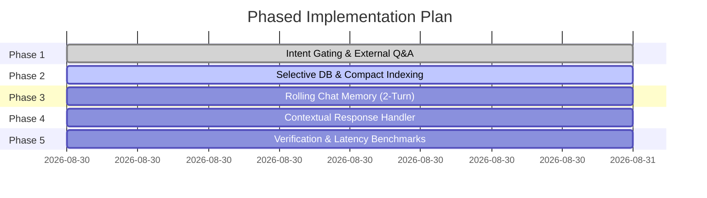

# Token-Optimized Context-Aware Omini Co-Pilot: Phased Implementation TODO Plan

## Phase Overview



---

## Phase 1: Intent Gating & Zero-Token Fast Path

**Goal**: Intercept external knowledge and general Q&A prompts before database ingestion or context construction to save 100% of DB queries and context tokens.

- [x] **Task 1.1**: Create `isExternalKnowledgeQuery(prompt: string): boolean` helper in `lib/agent/orchestrator.ts`.
  - Match general Q&A patterns: facts, science, coding explanations, translation, math, world knowledge (e.g. *"Who is prime minister of India?"*, *"How does binary search work?"*).
  - Exclude any prompt containing workspace keywords (`task`, `project`, `client`, `note`, `habit`, `goal`, `schedule`, `career`, `dsa`, `research`, `paper`).
- [x] **Task 1.2**: Implement Fast Path in `app/api/agent/co-pilot/route.ts`.
  - When `isExternalKnowledgeQuery` returns `true`, skip MongoDB database calls entirely.
  - Call `provider.generateStructured` or `provider.generateText` with a standard system prompt without workspace context.
  - Return `INFORMATIONAL_QUERY` response directly.

---

## Phase 2: Selective DB Ingestion & Ultra-Compact Workspace Indexing

**Goal**: Replace heavy database collection dumps with on-demand module fetching and a <50-token single-line state index.

- [x] **Task 2.1**: Implement `detectRequiredModules(prompt: string)` in `lib/agent/context/agentContextBuilder.ts`.
  - Analyze user prompt keywords to conditionally query MongoDB collections:
    - `notes`: `prompt.includes('note') || prompt.includes('memo')`
    - `projects`: `prompt.includes('project') || prompt.includes('client')`
    - `habits`: `prompt.includes('habit') || prompt.includes('streak')`
    - `goals`: `prompt.includes('goal') || prompt.includes('okr')`
    - `tasks`/`schedule`: `prompt.includes('task') || prompt.includes('schedule') || prompt.includes('workload') || prompt.includes('today') || prompt.includes('tomorrow')`
- [x] **Task 2.2**: Update MongoDB queries in `route.ts` to use `.select()` projection and `.limit(5)` to fetch minimal required fields.
- [x] **Task 2.3**: Implement `formatCompactWorkspaceIndex()` helper in `agentContextBuilder.ts`.
  - Serialize workspace state into a single-line string (~40-50 tokens):
    `Projects(2): Orbit OS, Client Alpha | Notes(2): System Design, Meeting 28Aug | Habits(2): Gym (4d), Reading (12d) | Pending Tasks(4): DP Practice, Fix Navbar`

---

## Phase 3: Sliding-Window 2-Turn Rolling Chat Memory

**Goal**: Provide Omini with multi-turn conversation awareness (resolving follow-ups and pronouns) while capping chat memory token load at <150 tokens.

- [x] **Task 3.1**: Update `RequestSchema` in `app/api/agent/co-pilot/route.ts` to accept `chatHistory`:
  ```ts
  chatHistory: z.array(z.object({
    role: z.enum(['user', 'assistant']),
    content: z.string()
  })).optional().default([])
  ```
- [x] **Task 3.2**: Update `handleSendMessage` in `components/agent/AgentCoPilotDrawer.tsx`.
  - Slice the active thread's messages to send only the last 2 messages (1 User turn + 1 Assistant turn):
  ```ts
  const chatHistory = activeThread.messages.slice(-2).map((m) => ({
    role: m.role,
    content: m.content
  }));
  ```
- [x] **Task 3.3**: Format `=== CONVERSATION HISTORY (Last 2 Turns) ===` into the LLM system prompt in `route.ts`.

---

## Phase 4: Intent Router & Context-Aware Response Handlers

**Goal**: Route response formatting cleanly between Informational Q&A, Omni-Module Actions, and Workload Schedules.

- [x] **Task 4.1**: Refine system prompt instructions for `generateStructured`:
  - Instruct LLM to check `CONVERSATION HISTORY` and `WORKSPACE INDEX` before resolving ambiguities ("that project", "task #2", "move it").
- [x] **Task 4.2**: Update `isAnalysisOnly` logic in `route.ts`.
  - If intent is `INFORMATIONAL_QUERY`, return `summary` response with empty `taskProposals` and `actionProposals` (suppressing unneeded automatic task cards).
- [x] **Task 4.3**: Integrate Omni-Module Action Proposals when explicit mutations are requested.

---

## Phase 5: Verification, Benchmarks & Git Commit

**Goal**: Validate full context understanding, measure token savings (>90%), run TypeScript type checking, and push code.

- [ ] **Task 5.1**: Run end-to-end scenario tests:
  - Test 1: External Q&A (*"Who is prime minister of India?"*) $\rightarrow$ Instant answer, 0 DB queries.
  - Test 2: Follow-up resolution (*"I need to work on Orbit project"* $\rightarrow$ *"Create a task for tomorrow morning for it"*).
  - Test 3: Module specific query (*"What notes do I have on system design?"*).
- [ ] **Task 5.2**: Run `npx tsc --noEmit` type check to verify zero compilation errors.
- [ ] **Task 5.3**: Commit changes and push branch to remote repository.
