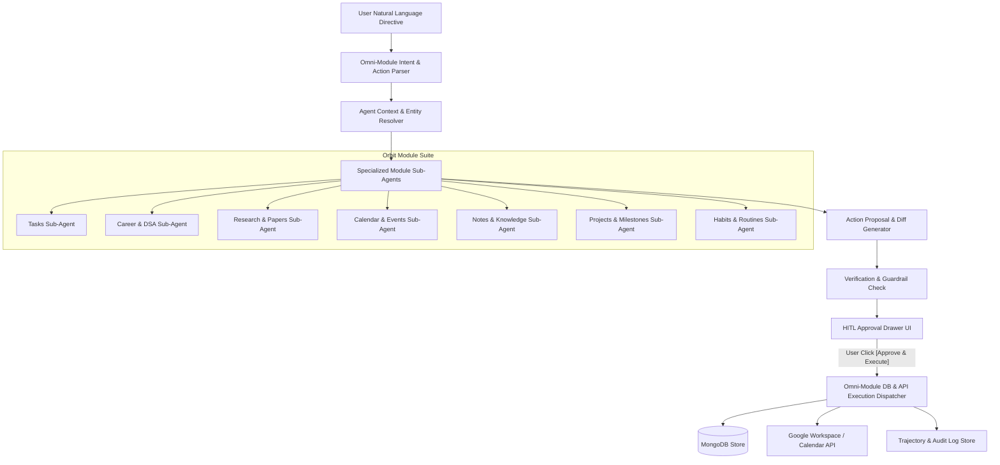

# Orbit Agent Co-Pilot — Omni-Module Full CRUD & Human-in-the-Loop (HITL) Implementation Plan

> **Target Platform:** Orbit ⭐ (`e:\meraj-os`)  
> **Goal:** Expand Orbit Agent Co-Pilot into a unified conversational and autonomous assistant capable of executing full **CRUD (Create, Read, Update, Delete)** operations across **all Orbit modules** (Tasks, Career, Research, Calendar, Notes, Projects, Habits, and Goals) with mandatory **Human-in-the-Loop (HITL) preview & approval guardrails**.

---

## 📌 Architecture & Design Principles

---

## 🎯 Supported Modules & Operations Matrix

| Module | Create | Read / Query | Update | Delete |
| :--- | :--- | :--- | :--- | :--- |
| **Tasks** | Add task with slot, priority, MIT, category, date | List pending, query by slot/tag/priority | Toggle complete, edit title/hours/slot/MIT | Soft/hard delete task |
| **Career & DSA** | Add new DSA topic, add subject exam plan | Find stale topics (`revised > 7d`), view syllabus progress | Mark questions solved, update revision date/notes, check checklist | Remove DSA topic or subject plan |
| **Research Engine** | Create research project, section, or add paper citation | Find unread papers (`isImportant`), check word count targets | Update section word count, mark paper read, edit takeaways | Delete paper, section, or project |
| **Calendar & Events** | Schedule event & sync to Google Calendar | Detect calendar occupancy & free/busy slots | Reschedule event time/duration, edit event details | Cancel event & remove from Google Calendar |
| **Notes & Knowledge** | Create quick note, memo, or checklist | Semantic/tag search notes, list pinned notes | Edit note content, pin/unpin note, update tags | Delete note |
| **Projects & Milestones**| Create project with target date & milestones | View project status, progress %, overdue milestones | Check off milestone, change project status | Delete project |
| **Habits & Routines** | Create new habit with target frequency & time slot | View habit streak, today's pending routines | Mark habit completed for today, increment streak | Archive / delete habit |
| **Goals & OKRs** | Create quarterly goal with Key Results | View OKR completion %, target deadlines | Log progress %, update KR target value | Delete goal |

---

## 🛡️ Human-in-the-Loop (HITL) Safety & Guardrail Rules

1. **Explicit Action Preview**: Co-Pilot will **never** silently alter or delete data. Every proposed operation produces a structured **Action Diff Preview Card** displaying:
   - **Operation Type**: `[CREATE]`, `[UPDATE]`, or `[DELETE]`.
   - **Module Badge**: e.g., `[CAREER]`, `[RESEARCH]`, `[TASKS]`.
   - **Entity Title & Fields**: Highlighted before/after changes.
2. **Destructive Action Safeguards**:
   - `DELETE` operations require double-confirmation with clear warning styling (`rose-500` badge).
   - Bulk operations (e.g. *"Delete all completed tasks"*) require explicit count verification.
3. **Verification Checks**:
   - Zero calendar overlap validation for time-bound items.
   - Workload capacity ceiling (< 7.0h total daily workload).

---

## 🗓️ Phased Implementation TODO Roadmap

### 🚀 Phase 1: Omni-Module Intent Parser & Schema Standards
- [ ] **Task 1.1: Unified Co-Pilot Action Payload Types (`lib/agent/types.ts`)**
  - Define `ModuleType`: `'tasks' | 'career' | 'research' | 'calendar' | 'notes' | 'projects' | 'habits' | 'goals'`.
  - Define `CrudOperationType`: `'CREATE' | 'READ' | 'UPDATE' | 'DELETE'`.
  - Define `AgentActionProposal` interface containing `actionId`, `module`, `opType`, `entityId`, `targetData`, and `diffPreview`.
- [ ] **Task 1.2: Omni-Intent Parser Expansion (`lib/agent/orchestrator.ts`)**
  - Extend `parseUserIntentPrompt()` to recognize CRUD keywords across all 8 modules (e.g. *"mark DSA topic DP as revised"*, *"add paper Attention Is All You Need to Research"*, *"delete task XYZ"*).

---

### 🛠️ Phase 2: Specialized Module Sub-Agents & Tools
- [ ] **Task 2.1: Notes & Knowledge Sub-Agent (`lib/agent/tools/notesTools.ts`)**
  - Create note tool: `createNote(title, content, tags, folder)`.
  - Update note tool: `updateNote(noteId, updates)`.
  - Delete note tool: `deleteNote(noteId)`.
- [ ] **Task 2.2: Projects & Milestones Sub-Agent (`lib/agent/tools/projectsTools.ts`)**
  - Create project tool: `createProject(title, description, milestones)`.
  - Update milestone tool: `toggleMilestone(projectId, milestoneId, completed)`.
- [ ] **Task 2.3: Habits & Routines Sub-Agent (`lib/agent/tools/habitsTools.ts`)**
  - Complete habit tool: `logHabitCompletion(habitId, date)`.
  - Create habit tool: `createHabit(name, frequency, timeSlot)`.
- [ ] **Task 2.4: Research & Career Expanded Tools**
  - Expand `careerTools.ts` to support question count updates (`updateDsaQuestions`) and syllabus checking.
  - Expand `researchTools.ts` to support paper creation (`addResearchPaper`) and section word count updates.

---

### 🎨 Phase 3: Generic Action Proposal Card & HITL UI Drawer
- [ ] **Task 3.1: Multi-Module Proposal UI Card (`components/agent/ActionProposalCard.tsx`)**
  - Design visual cards for each operation type:
    - **Green Badge** for `CREATE` (shows new item details).
    - **Blue/Amber Badge** for `UPDATE` (shows field diffs, e.g. `Solved Questions: 12 -> 15`).
    - **Rose Badge** for `DELETE` (shows item to be removed with confirmation checkbox).
- [ ] **Task 3.2: Universal Execution Dispatcher (`app/api/agent/execute-action/route.ts`)**
  - Create secure execution route that handles incoming approved `AgentActionProposal` objects and executes the corresponding MongoDB operations and Zustand store updates.

---

### 📊 Phase 4: Verification, Audit Log & Benchmark Expansion
- [ ] **Task 4.1: Omni-Module Audit Trajectory Logging (`lib/agent/historyStore.ts`)**
  - Record execution trajectories with full before/after snapshots for auditability.
- [ ] **Task 4.2: Benchmark Dataset Update (`scripts/eval_benchmark.ts`)**
  - Add test scenarios `TC-11` to `TC-15` testing Notes creation, Career progress logging, Research paper addition, and Task deletion.

---

## 🛠️ Verification & Test Scenarios

1. **Scenario 1 (Task CRUD)**: Prompt: *"Create a high priority task for this evening to review Next.js server components"* -> Co-Pilot generates `CREATE` proposal -> User approves -> Task created in MongoDB & synced.
2. **Scenario 2 (Career Update)**: Prompt: *"Log 4 completed DP questions and mark Dynamic Programming as revised today"* -> Co-Pilot generates `UPDATE` proposal for `Career.dsaTopics` -> User approves -> Database updated.
3. **Scenario 3 (Research Paper Create)**: Prompt: *"Add paper 'LoRA: Low-Rank Adaptation' to my AI Research project"* -> Co-Pilot generates `CREATE` paper proposal -> User approves -> Paper appended to Research project section.
4. **Scenario 4 (Notes & Knowledge)**: Prompt: *"Create a note titled 'Hackathon Final Checklist' with items: 1. Video demo 2. PR review"* -> Co-Pilot generates `CREATE` note proposal -> User approves -> Note saved.
5. **Scenario 5 (Delete Guardrail)**: Prompt: *"Delete task 'Old Draft Setup'"* -> Co-Pilot generates `DELETE` proposal with confirmation alert -> User approves -> Task deleted.

---
*Prepared for Orbit ⭐ | Next-Gen AI Personal Productivity OS*
