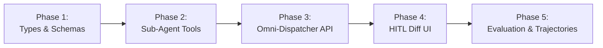

# Orbit Agent Co-Pilot — Omni-Module Full CRUD & HITL Phased TODO Checklist

> **Target Application:** Orbit ⭐ (`e:\meraj-os`)  
> **Goal:** Actionable, step-by-step development checklist to enable full **Create, Read, Update, Delete (CRUD)** capabilities across all 8 Orbit modules with mandatory **Human-in-the-Loop (HITL)** preview & approval guardrails.

---

## 📌 Implementation Phase Workflow



---

## 🚀 Phase 1: Core Types, Action Schemas & Intent Parser (Days 1–2)

- [x] **Task 1.1: Define Unified Action Proposal Schemas (`lib/agent/types.ts`)**
  - Add `ModuleType`: `'tasks' | 'career' | 'research' | 'calendar' | 'notes' | 'projects' | 'habits' | 'goals'`.
  - Add `CrudOp`: `'CREATE' | 'READ' | 'UPDATE' | 'DELETE'`.
  - Add `AgentActionProposal` interface:
    ```typescript
    export interface AgentActionProposal {
      actionId: string;
      module: ModuleType;
      opType: CrudOp;
      entityId?: string;
      title: string;
      description: string;
      targetData: Record<string, unknown>;
      diffPreview?: {
        field: string;
        before: unknown;
        after: unknown;
      }[];
      requiresConfirmation: boolean;
      status: 'pending' | 'approved' | 'executed' | 'discarded';
    }
    ```

- [x] **Task 1.2: Expand Natural Language Intent Parser (`lib/agent/orchestrator.ts`)**
  - Update `parseUserIntentPrompt()` to extract action verbs (`create`, `add`, `mark`, `update`, `complete`, `delete`, `remove`, `reschedule`).
  - Add module keyword classification:
    - **Career**: `"dsa"`, `"revision"`, `"solved"`, `"subject"`, `"syllabus"`.
    - **Research**: `"paper"`, `"citation"`, `"abstract"`, `"word count"`, `"journal"`.
    - **Notes**: `"note"`, `"memo"`, `"checklist"`, `"pinned"`.
    - **Projects**: `"milestone"`, `"project"`, `"deadline"`.
    - **Habits**: `"habit"`, `"routine"`, `"streak"`.
    - **Goals**: `"okr"`, `"goal"`, `"key result"`.

- [x] **Task 1.3: Update LLM System Prompt & Zod Schemas (`app/api/agent/co-pilot/route.ts`)**
  - Expand LLM prompt system directive to support generating multi-module `AgentActionProposal` items.
  - Update `StructuredSchema` with Zod preprocess to validate module action proposals cleanly without parsing errors.

---

## 🛠️ Phase 2: Module-Specific Tool Suites (Days 2–4)

### 2.1 Notes & Knowledge Base Sub-Agent (`lib/agent/tools/notesTools.ts`)
- [x] **Task 2.1.1: Create Note Tool** — `createNoteProposal(title, content, tags, folder)`
- [x] **Task 2.1.2: Update Note Tool** — `updateNoteProposal(noteId, fieldUpdates)`
- [x] **Task 2.1.3: Delete Note Tool** — `deleteNoteProposal(noteId)`

### 2.2 Projects & Milestones Sub-Agent (`lib/agent/tools/projectsTools.ts`)
- [x] **Task 2.2.1: Create Project Tool** — `createProjectProposal(title, description, milestones)`
- [x] **Task 2.2.2: Toggle Milestone Tool** — `toggleMilestoneProposal(projectId, milestoneId, completed)`
- [x] **Task 2.2.3: Delete Project Tool** — `deleteProjectProposal(projectId)`

### 2.3 Habits & Routines Sub-Agent (`lib/agent/tools/habitsTools.ts`)
- [x] **Task 2.3.1: Log Habit Completion Tool** — `completeHabitProposal(habitId, date)`
- [x] **Task 2.3.2: Create Habit Tool** — `createHabitProposal(name, frequency, timeSlot)`
- [x] **Task 2.3.3: Archive Habit Tool** — `archiveHabitProposal(habitId)`

### 2.4 Goals & OKR Sub-Agent (`lib/agent/tools/goalsTools.ts`)
- [x] **Task 2.4.1: Log KR Progress Tool** — `updateKeyResultProgressProposal(goalId, krId, progressVal)`
- [x] **Task 2.4.2: Create Goal Tool** — `createGoalProposal(title, targetDate, keyResults)`

### 2.5 Career & Research Engine Tool Expansions
- [x] **Task 2.5.1: Log DSA Question Progress** — `updateDsaQuestionsProposal(topicId, questionsAdded, markRevised)` in `careerTools.ts`.
- [x] **Task 2.5.2: Add Research Paper Citation** — `addResearchPaperProposal(projectId, sectionId, paperDetails)` in `researchTools.ts`.
- [x] **Task 2.5.3: Update Section Word Count Target** — `updateSectionWordCountProposal(projectId, sectionId, targetWords)` in `researchTools.ts`.

---

## ⚡ Phase 3: Universal Execution Dispatcher API (Days 4–5)

- [x] **Task 3.1: Universal Action Execution Route (`app/api/agent/execute-action/route.ts`)**
  - Create secure POST route accepting `{ actionProposal: AgentActionProposal }`.
  - Dispatch execution based on `actionProposal.module` and `opType`:
    - `tasks` -> Updates `Task` collection & triggers `useTaskStore.addTask` / `updateTask`.
    - `career` -> Updates `Career` collection (`dsaTopics`, `subjectPlans`) & triggers `useCareerStore`.
    - `research` -> Updates `Research` collection & triggers `useResearchStore`.
    - `calendar` -> Updates `CalendarEvent` collection & syncs Google Calendar API.
    - `notes` -> Updates `Note` collection.
    - `projects` -> Updates `Project` collection.
    - `habits` -> Updates `Habit` collection.
    - `goals` -> Updates `Goal` collection.
  - Return `{ success: true, executedActionId, updatedData }`.

- [x] **Task 3.2: Client-Side Store Sync Pipeline**
  - Wire frontend Zustand store listeners so UI components immediately reflect executed Co-Pilot actions without needing manual page refreshes.

---

## 🎨 Phase 4: HITL Action Preview Cards & UI Drawer (Days 5–6)

- [x] **Task 4.1: Multi-Module Action Proposal Card Component (`components/agent/ActionProposalCard.tsx`)**
  - Render color-coded badges for operation types:
    - 🟢 `CREATE` (Emerald badge): Shows new entity title and properties.
    - 🔵 `UPDATE` (Blue/Amber badge): Shows field diff table (Before vs. After).
    - 🔴 `DELETE` (Rose badge): Shows warning banner and double-confirmation checkbox.
- [x] **Task 4.2: Integrate Proposal Stream in Drawer (`components/agent/AgentCoPilotDrawer.tsx`)**
  - Render `ActionProposalCard` items inside scrollable proposal view.
  - Wire **"Approve & Execute All"** and individual **"Approve Action"** buttons to invoke `/api/agent/execute-action`.
- [x] **Task 4.3: Toast Feedback & Trajectory Log Sync**
  - Display success toast upon execution (e.g. *"Successfully logged 4 DP questions & updated revision date"*).
  - Update `CoPilotHistoryItem` status to `'approved'`.

---

## 📊 Phase 5: Benchmark Expansion & Trajectory Auditing (Days 6–7)

- [ ] **Task 5.1: Extend Evaluation Scenarios (`lib/agent/eval/evaluationDataset.ts`)**
  - Add `TC-11`: Note creation and tagging via Co-Pilot.
  - Add `TC-12`: Log DSA questions solved and update topic revision status.
  - Add `TC-13`: Add research paper citation to Research project section.
  - Add `TC-14`: Reschedule calendar event with zero-conflict check.
  - Add `TC-15`: Safe deletion of obsolete task with double confirmation.

- [ ] **Task 5.2: Execute Benchmark Suite (`scripts/eval_benchmark.ts`)**
  - Run `npx tsx scripts/eval_benchmark.ts` to verify 100% accuracy across all 15 test scenarios.
  - Update benchmark results in `docs/BENCHMARK_RESULTS.md`.

- [ ] **Task 5.3: Trajectory Logs Verification**
  - Capture raw trajectory JSON logs in `docs/trajectories/tc-11_trajectory.json` through `tc-15_trajectory.json`.

---

## 🛠️ Verification & Acceptance Checklist

| Module | Verification Step | Status |
| :--- | :--- | :--- |
| **Tasks** | Create, update, complete, and delete task via Co-Pilot prompt | Pending |
| **Career** | Update solved question count & revision status via prompt | Pending |
| **Research** | Add paper citation & update section target word count | Pending |
| **Calendar** | Reschedule event & verify Google Calendar zero-overlap sync | Pending |
| **Notes** | Create, pin, and search note via natural language | Pending |
| **Projects** | Create project & toggle milestone checklist item | Pending |
| **Habits** | Log habit completion & verify streak increment | Pending |
| **Goals** | Update Key Result progress % via prompt | Pending |

---
*Created for Orbit ⭐ | Next-Gen AI Personal Productivity OS Phased Implementation Checklist*
