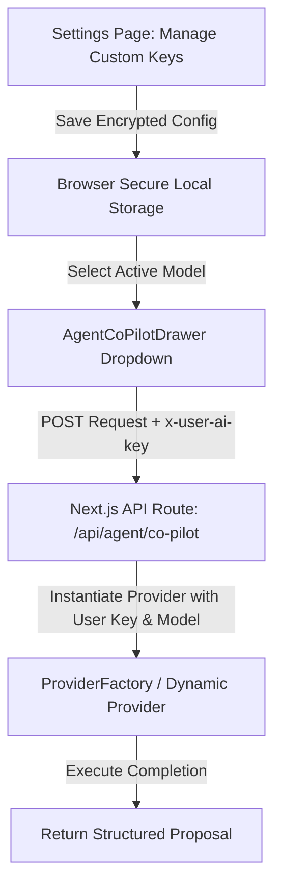

# Architectural Implementation Plan: Custom User AI Keys & Dynamic Model Router (BYOK)

## Executive Summary
This document outlines the architectural plan for implementing **Bring Your Own Key (BYOK) for AI Providers & Custom Models** in Orbit OS. The goal is to allow users to securely supply, manage, and switch between their own LLM API keys (OpenAI, Anthropic, Google Gemini, Groq, custom Ollama endpoints) without requiring host-managed backend API keys.

---

## Key Requirements & Design Principles

1. **Security First**:
   - API Keys are encrypted/masked client-side or sent over HTTPS and stored in local secure storage (`localStorage`/`IndexedDB`).
   - Passed via encrypted request headers (`x-user-ai-key`) to the server execution route (`/api/agent/co-pilot`). Keys are never saved to server database logs or exposed in API responses.

2. **Dynamic Drawer Model Dropdown**:
   - The model selector dropdown in `AgentCoPilotDrawer.tsx` will **dynamically filter** to display ONLY user-configured active models, plus built-in zero-key models (`Gemini Nano`).
   - **Local Environment Flag**: In local development (`localhost` or `NODE_ENV === 'development'`), `Ollama (Local Offline)` is automatically included in the dropdown options.

3. **Multi-Model Provider Management in Settings**:
   - Located under a dedicated **"AI Co-Pilot & Provider Keys"** section in `app/settings/page.tsx`.
   - Users can add multiple configurations (e.g. OpenAI `gpt-4o`, Anthropic `claude-3-5-sonnet`, Gemini `gemini-1.5-pro`, Groq `llama-3.3-70b-versatile`).
   - Supports key connection testing (validation check against provider API).

---

## Proposed Architecture & Data Structures



### 1. Data Schema (`UserAIConfig`)
```ts
export interface UserAIModelConfig {
  id: string; // e.g. 'cfg_174092000'
  providerId: 'openai' | 'anthropic' | 'gemini' | 'groq' | 'ollama';
  name: string; // User friendly label (e.g., "My GPT-4o Key")
  modelName: string; // Actual API model identifier (e.g. "gpt-4o", "claude-3-5-sonnet-20241022", "gemini-1.5-pro")
  apiKey: string; // Encrypted or masked client key
  baseUrl?: string; // Optional custom endpoint for Ollama or OpenAI-compatible proxies
  isActive?: boolean;
}
```

### 2. Security Infrastructure (`lib/security/keyCrypto.ts`)
- Client-side lightweight symmetric encryption / obfuscation (using `crypto.subtle` or base64 XOR string obfuscation) before storing in browser storage.
- Request Header payload:
  `x-user-ai-key`: Masked/Encrypted key string decrypted strictly in server memory during request lifecycle.

---

## Phased Implementation Plan

### Phase 1: Settings Store & Storage Security Layer
- **Task 1.1**: Create `UserAIModelConfig` interface in `lib/agent/types.ts`.
- **Task 1.2**: Implement `useAIConfigStore` in `store/useAIConfigStore.ts` to manage addition, edition, deletion, and active selection of custom AI keys and models.
- **Task 1.3**: Add helper functions for key masking/unmasking.

### Phase 2: User AI Settings UI in Settings Page
- **Task 2.1**: Build `CustomAISettingsPanel` in `components/settings/CustomAISettingsPanel.tsx`.
- **Task 2.2**: Allow users to add a new model:
  - Provider Selector (OpenAI, Anthropic, Gemini, Groq, Custom Ollama)
  - Custom Label Name
  - Model ID string (e.g., `gpt-4o-mini`, `claude-3-5-haiku`, `gemini-1.5-flash`)
  - Secret API Key Input (password masked with toggle visibility)
  - Optional Custom Base URL (for self-hosted Ollama or local LLMs)
- **Task 2.3**: Integrate `CustomAISettingsPanel` into `app/settings/page.tsx`.

### Phase 3: Provider Factory & Server API Route Integration
- **Task 3.1**: Update `ProviderFactory.getProvider(providerId, userConfig)` in `lib/agent/providers/providerFactory.ts` to pass custom `apiKey`, `modelName`, and `baseUrl` dynamically to `GeminiProvider`, `OpenAIProvider`, `AnthropicProvider`, and `GroqProvider`.
- **Task 3.2**: Update `/api/agent/co-pilot/route.ts` to accept `userConfig` from request body/headers and instantiate the dynamic provider cleanly.

### Phase 4: Dynamic Drawer Model Dropdown Filtering
- **Task 4.1**: Update `AgentCoPilotDrawer.tsx` model selection logic:
  - Fetch configured models from `useAIConfigStore`.
  - Filter options to show ONLY configured user models + `Gemini Nano`.
  - Check local environment (`window.location.hostname === 'localhost'` or `process.env.NODE_ENV === 'development'`) to conditionally include `Ollama (Local Offline)`.
- **Task 4.2**: Set the active default selection to the user's primary active key or Gemini Nano / Ollama.

### Phase 5: Verification & End-to-End Testing
- **Task 5.1**: Test adding custom keys (e.g., Gemini, Groq, OpenAI).
- **Task 5.2**: Test model switching in `AgentCoPilotDrawer`.
- **Task 5.3**: Verify local environment flag behavior for Ollama.
- **Task 5.4**: Run `npx tsc --noEmit` to verify type safety.
