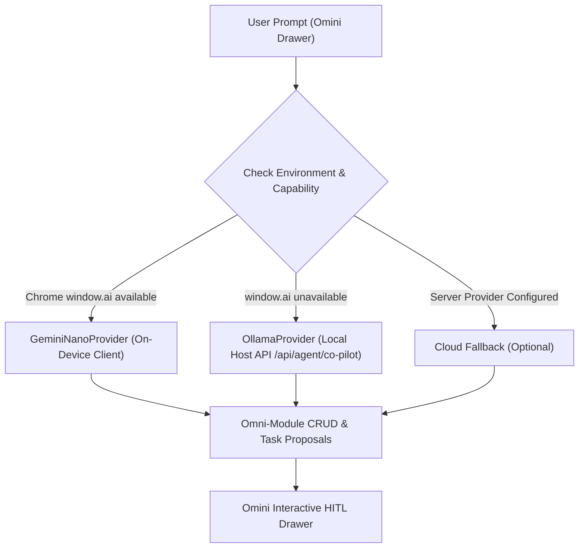

# 🔮 Gemini Nano (Chrome Built-in AI) Integration Plan for Orbit & Omini

> **Executive Summary**: This document evaluates the feasibility, architecture, and implementation blueprint for integrating **Gemini Nano**—Google's on-device LLM natively embedded in Chrome—into Orbit OS and the **Omini Agent Co-Pilot**. It details how Gemini Nano eliminates API keys, removes cloud infrastructure costs, guarantees 100% privacy, and works as a zero-latency local fallback alongside Ollama.

---

## 🎯 1. Overview & Key Advantages

**Gemini Nano** is Chrome's built-in, local AI model powered by WebGPU and the Chrome AI Prompt API (`window.ai.languageModel`). 

### Why Gemini Nano for Orbit OS & Omini?
- 🔑 **Zero API Keys Required**: No registration, no secret management, no quota limits.
- 🔒 **100% On-Device & Private**: All prompt parsing, task categorization, and CRUD intent extraction happen directly within the user's browser engine.
- ⚡ **Zero Network Latency**: No round-trip HTTP overhead to cloud endpoints—instant response times.
- 💰 **Zero Cost**: Completely free to run locally without server compute or API tokens.
- 🌐 **Offline Resilience**: Functions seamlessly without an active internet connection.

---

## 🏗️ 2. Architectural Blueprint: Provider Pattern with Fallback

Orbit's LLM architecture utilizes a flexible Provider Pattern (`lib/agent/providers/`). We can add `GeminiNanoProvider` as a client-side provider with an automatic fallback hierarchy:



---

## 💻 3. Technical Implementation Specification

### 3.1. Browser Capability Detection (`lib/agent/providers/geminiNanoCheck.ts`)

```typescript
export interface GeminiNanoStatus {
  isSupported: boolean;
  availability: 'readily' | 'after-download' | 'no';
}

export async function checkGeminiNanoSupport(): Promise<GeminiNanoStatus> {
  if (typeof window === 'undefined' || !('ai' in window)) {
    return { isSupported: false, availability: 'no' };
  }

  try {
    // @ts-ignore - Chrome Experimental Prompt API
    const capabilities = await window.ai.languageModel.capabilities();
    return {
      isSupported: capabilities.available !== 'no',
      availability: capabilities.available,
    };
  } catch (error) {
    return { isSupported: false, availability: 'no' };
  }
}
```

### 3.2. `GeminiNanoProvider.ts` (`lib/agent/providers/GeminiNanoProvider.ts`)

```typescript
import { BaseAgentProvider } from './BaseAgentProvider';

export class GeminiNanoProvider implements BaseAgentProvider {
  name = 'gemini-nano';
  private session: any = null;

  async init(): Promise<void> {
    if (typeof window !== 'undefined' && 'ai' in window) {
      // @ts-ignore
      this.session = await window.ai.languageModel.create({
        systemPrompt: 'You are Omini, an AI Co-Pilot for personal productivity OS. Return valid JSON proposals.',
      });
    }
  }

  async generateStructuredOutput(
    systemPrompt: string,
    userPrompt: string,
    schema: any
  ): Promise<any> {
    if (!this.session) await this.init();
    
    const fullPrompt = `${systemPrompt}\n\nUser Input: ${userPrompt}\n\nRespond ONLY with valid JSON matching schema.`;
    const responseText = await this.session.prompt(fullPrompt);

    // Extract JSON block from response
    const jsonMatch = responseText.match(/\{[\s\S]*\}/);
    return JSON.parse(jsonMatch ? jsonMatch[0] : responseText);
  }
}
```

---

## 🚦 4. Chrome Enablement & User Setup Guide

Because Gemini Nano is currently available via Chrome Built-in AI flags, users can enable it in 3 simple steps:

1. **Open Chrome Flags**:
   Navigate to `chrome://flags/#prompt-api-for-gemini-nano` in Chrome (v126+).
2. **Enable Prompt API**:
   Set `#prompt-api-for-gemini-nano` to **Enabled**.
3. **Enable On-Device Model Download**:
   Navigate to `chrome://flags/#optimization-guide-on-device-model` and set to **Enabled BypassPerfRequirement**.
4. **Restart Chrome**:
   Relaunch Chrome. The browser will automatically download the lightweight Gemini Nano model (~1.5GB) once in the background.

---

## 📊 5. Feature & Performance Comparison

| Feature | 🔮 Gemini Nano (Built-in) | 🦙 Ollama (Local Server) | ☁️ Cloud API (OpenAI/Gemini Cloud) |
| :--- | :--- | :--- | :--- |
| **API Key Required** | ❌ **No** | ❌ **No** | ────── **Yes** |
| **Execution Location** | In-Browser (Client WebGPU) | Local Background Process | Cloud Servers |
| **Network Egress** | Zero | Zero | High |
| **Response Latency** | ~200ms – 500ms | ~1s – 3s | ~2s – 5s |
| **Hardware Overhead** | Lightweight (Browser RAM) | Medium (System RAM/VRAM) | Zero System RAM |
| **Privacy Guarantee** | 100% Local | 100% Local | Data sent to cloud |

---

## 🚀 6. Next Steps & Integration Roadmap

- [x] **Phase 1**: Technical feasibility study and architecture document (`GEMINI_NANO_INTEGRATION_PLAN.md`).
- [ ] **Phase 2**: Implement `GeminiNanoProvider.ts` in `lib/agent/providers/`.
- [ ] **Phase 3**: Add automatic detection in `AgentCoPilotDrawer.tsx` to display **"Gemini Nano (Built-in On-Device)"** in the provider selector dropdown.
- [ ] **Phase 4**: Benchmark Gemini Nano parsing speed and accuracy against `eval_benchmark.ts`.

---
*Created for Orbit ⭐ | Next-Gen AI Personal Productivity OS Architecture Documentation*
