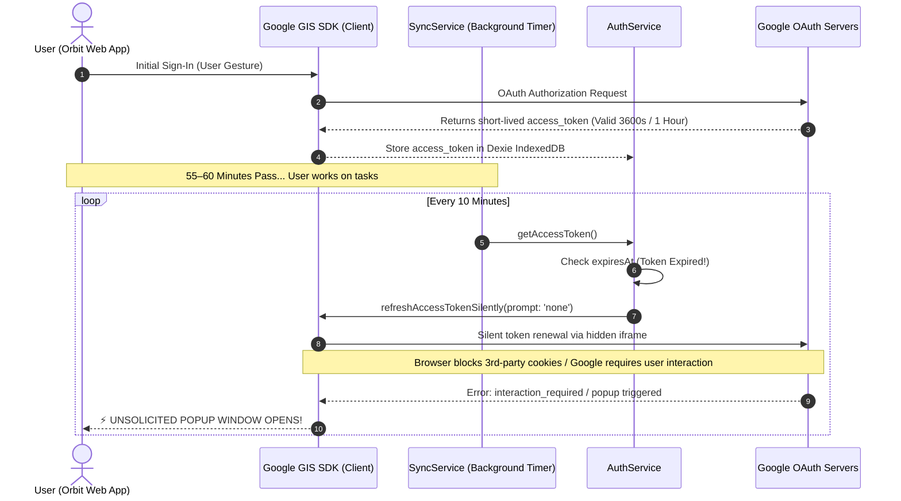
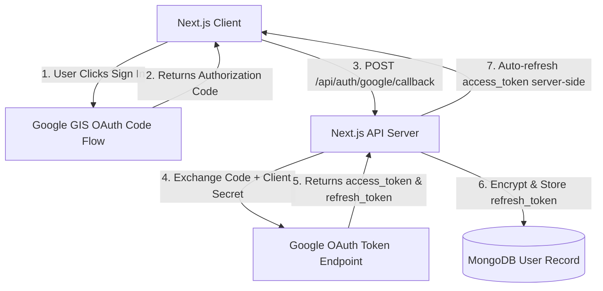

# Orbit --- Google OAuth Auto-Sync Popup Issue: Root Cause Analysis & Technical Solution Plan

> **Issue Report**: "After some time of login, the Google provider popup opens automatically for syncing."  
> **Impact**: High UX disruption (unsolicited OAuth popup windows interrupting active work).  
> **Affected System**: Google Identity Services (GIS) / Google Tasks & Calendar Background Sync Engine.

---

## 🎯 Executive Summary

The unexpected Google OAuth popup window that appears after a period of use is caused by **Access Token Expiration (1-hour lifespan) combined with Browser Third-Party Cookie Restrictions blocking Silent Token Renewal (`prompt: 'none'`) during automated background sync cycles (`setInterval` every 10 minutes)**.

Because Orbit currently uses **Client-Side OAuth 2.0 Implicit Token Flow**, Google does **NOT** provide a long-lived `refresh_token`. When the 60-minute `access_token` expires, background sync routines attempt to silently acquire a new token. Modern browser privacy policies (Chrome, Safari ITP, Edge) block silent cross-origin iframe authentication, causing Google's client SDK to either fail or fallback into launching an interactive Google OAuth popup window while the user is typing or navigating.

---

## 🔍 Detailed Root Cause Analysis



### 1. Short-Lived Access Token Lifespan (60 Minutes)
Google OAuth 2.0 access tokens generated in client-side applications (`google.accounts.oauth2.initTokenClient`) have a strict maximum lifetime of **3600 seconds (1 hour)**. There is no refresh token returned in implicit client-side flow.

### 2. Failure of Silent Token Refresh (`prompt: 'none'`)
In `services/google/auth.service.ts`:
```typescript
// auth.service.ts line 174
const client = window.google.accounts.oauth2.initTokenClient({
  client_id: CLIENT_ID,
  scope: SCOPES,
  prompt: 'none',
  callback: async (tokenResponse) => { ... }
});
client.requestAccessToken({ prompt: 'none' });
```
When `client.requestAccessToken({ prompt: 'none' })` is executed:
- Modern web browsers enforce strict Privacy Sandbox and Intelligent Tracking Prevention (ITP) rules, blocking third-party cookies from `accounts.google.com`.
- Without third-party cookie access, Google cannot silently verify the user's session without interactive consent.
- Google GIS SDK rejects silent refresh and issues an `interaction_required` error or automatically falls back to opening a popup window.

### 3. Automated Background Sync Timer (`setInterval`)
In `services/google/sync.service.ts`:
```typescript
// sync.service.ts line 33
this.autoSyncInterval = setInterval(() => {
  if (navigator.onLine) {
    this.syncAll(false);
  }
}, 600000); // 10 minutes
```
Every 10 minutes, `syncAll(false)` executes in the background. Once the 60-minute token expires:
1. `syncAll()` requests a token via `authService.getAccessToken()`.
2. `getAccessToken()` detects expiration and attempts silent refresh.
3. Silent refresh fails or triggers the Google GIS popup window unexpectedly.

---

## 🛠️ Comprehensive Solution Plan

We outline two complementary solutions: an **Immediate Client-Side Fix** (Phase 1) to eliminate unwanted popups immediately, and a **Permanent Server-Side Architecture** (Phase 2).

---

### Phase 1: Immediate Client-Side Fix (Prevent Automated Popups & Add Re-Auth Badge)

#### Objective
Ensure that **no OAuth popups or auth triggers EVER occur automatically in background routines**. If a token expires, background Google sync pauses gracefully while local application capabilities remain 100% operational.

#### Action Items

1. **Strictly Disable Silent Popup Fallbacks in `auth.service.ts`**:
   - Modify `getAccessToken()` so that if the token is expired and silent refresh fails, it returns `null` **without opening any popup window or SDK auth dialog**.

2. **Update Background `syncService.ts` to Handle Token Expiration Silently**:
   - In `syncAll(isInteractive)`:
     - If `token` is `null` and `isInteractive === false` (background sync): **Do NOT attempt to re-authenticate or open popups**.
     - Set sync status to `'session_expired'` and notify UI.
     - Continue allowing full local IndexedDB and MongoDB CRUD operations.

3. **Add "Re-connect Google Sync" Header Indicator**:
   - When `syncState === 'session_expired'`, display a subtle, non-intrusive status pill in the Top Bar (e.g. `⚡ Google Sync Expired — Click to Reconnect`).
   - Clicking this pill invokes `syncNow()` / `signIn()` with an explicit user gesture, opening the Google popup only when explicitly requested by the user.

---

### Phase 2: Permanent Architectural Solution (Server-Side Refresh Tokens)

#### Objective
Migrate from Client-Side Implicit Flow to **Server-Side Authorization Code Exchange Flow** to obtain a permanent, long-lived `refresh_token`.



#### Key Benefits
- **Zero Browser Popups**: The server automatically fetches fresh `access_token`s using the stored `refresh_token` in background HTTP requests without requiring browser user interaction.
- **Robust Background Sync**: Server cron jobs or API endpoints can sync Google Calendar and Tasks even when the user's browser tab is closed.
- **Enhanced Security**: Client secret and refresh tokens remain securely on the server-side.

---

## 📝 Implementation Code Snippets (Phase 1 Fix)

### 1. `services/google/auth.service.ts` (Prevent Popup Triggers)
```typescript
public async getAccessToken(): Promise<string | null> {
  const session = await this.getSession();
  if (!session || !session.accessToken) return null;

  // Return valid token if not expiring within 5 minutes
  if (session.expiresAt && Date.now() < session.expiresAt - 5 * 60 * 1000) {
    return session.accessToken;
  }

  // Token expired: Attempt silent refresh with strict suppression of popups
  console.log('[AuthService] Token expired. Attempting silent renewal...');
  const refreshedSession = await this.refreshAccessTokenSilently();
  if (refreshedSession && refreshedSession.accessToken) {
    return refreshedSession.accessToken;
  }

  console.warn('[AuthService] Silent token renewal failed. Token expired.');
  return null;
}
```

### 2. `services/google/sync.service.ts` (Graceful Background Pause)
```typescript
public async syncAll(isInteractive = false): Promise<void> {
  if (this.isSyncInProgress || !navigator.onLine) return;

  const session = await authService.getSession();
  if (!session) return;

  let token = await authService.getAccessToken();

  if (!token) {
    if (isInteractive) {
      // User clicked Sync explicitly -> trigger interactive login popup
      const newSession = await authService.signIn();
      token = newSession?.accessToken || null;
      if (!token) return;
    } else {
      // Background sync: Gracefully pause remote sync without triggering popups
      console.log('[SyncService] Background sync paused: Google OAuth token expired.');
      this.notify('session_expired', 'Google sync paused (Token expired). Click to reconnect.');
      return;
    }
  }

  // Execute sync routines...
}
```

---

## 🚀 Verification & Testing Protocol

1. **Token Expiration Simulation**:
   - Manually set `session.expiresAt = Date.now() - 1000` in Dexie IndexedDB.
   - Trigger background sync (`syncService.syncAll(false)`).
   - **Expected Outcome**: No Google popup opens. App displays `'session_expired'` state gracefully in UI.

2. **Interactive Re-Auth Verification**:
   - Click the "Reconnect Google Sync" header button.
   - **Expected Outcome**: Google OAuth popup launches upon user gesture, updates `accessToken` and `expiresAt`, and resumes active sync.
