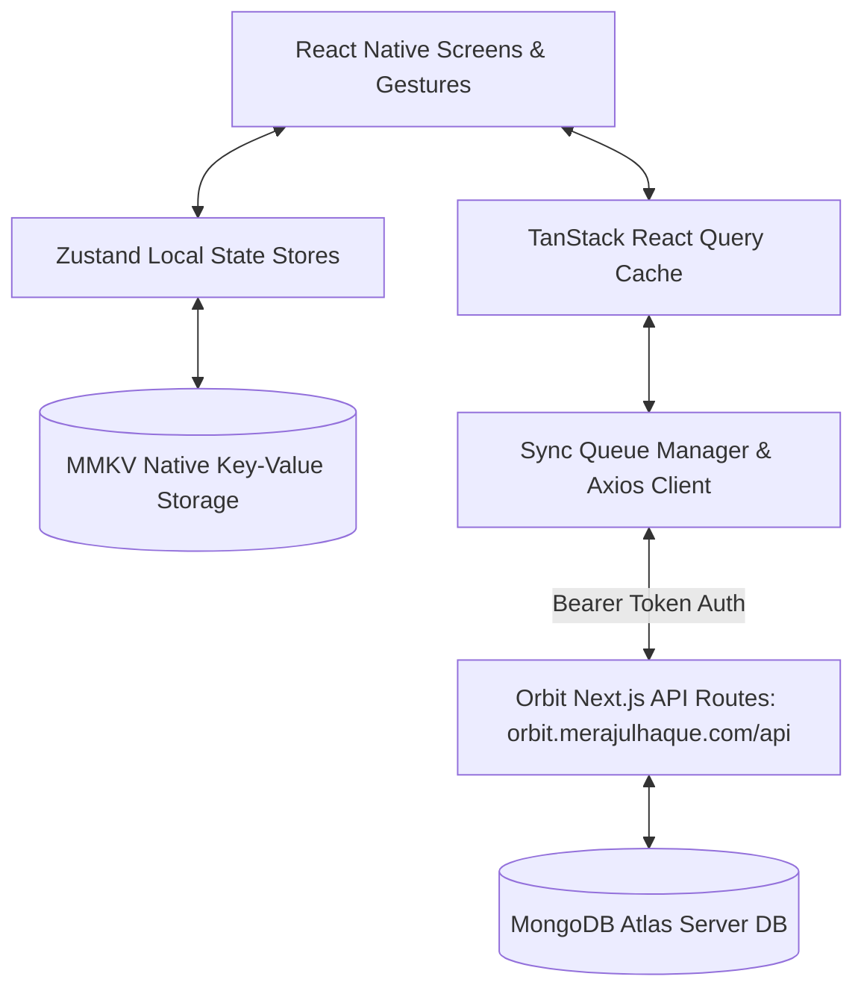

# Orbit Mobile V2 --- Mobile App Design System, Architecture & API Specification

> **Base API URL**: `https://orbit.merajulhaque.com/api`  
> **Target Framework**: React Native CLI 0.76+ (TypeScript)  
> **Offline Engine**: MMKV Key-Value + Zustand + TanStack Query v5  
> **Design Philosophy**: Glassmorphism, Modern HSL Palettes, Bottom-Sheet First, Fluid Gestures & Haptics

---

## 📋 Table of Contents
1. [Executive Blueprint & Mobile Architecture](#1-executive-blueprint--mobile-architecture)
2. [Mobile UX & Glassmorphic Design System](#2-mobile-ux--glassmorphic-design-system)
3. [Complete Backend API Catalog & Schemas](#3-complete-backend-api-catalog--schemas)
   - [Authentication & User Scoping](#31-authentication--user-scoping)
   - [Personalization & User Preferences](#32-personalization--user-preferences)
   - [Today & Task Management Engine](#33-today--task-management-engine)
   - [Calendar & Event Synchronization](#34-calendar--event-synchronization)
   - [Multi-Project Research Hub](#35-multi-project-research-hub)
   - [Career & DSA Mastery Pipeline](#36-career--dsa-mastery-pipeline)
   - [Projects & Client CRM (With Shared Access)](#37-projects--client-crm-with-shared-access)
   - [Weekly Planning & Reflection](#38-weekly-planning--reflection)
   - [Saved Links & Resource Bookmark Hub](#39-saved-links--resource-bookmark-hub)
   - [Notes & Document Engine](#310-notes--document-engine)
   - [Analytics & Settings](#311-analytics--settings)
4. [Offline-First Sync Engine & Queue Architecture](#4-offline-first-sync-engine--queue-architecture)
5. [Screen-by-Screen UI & Component Blueprint](#5-screen-by-screen-ui--component-blueprint)
6. [Step-by-Step Implementation Roadmap](#6-step-by-step-implementation-roadmap)

---

## 1. Executive Blueprint & Mobile Architecture

The **Orbit Mobile V2** application extends the web version of Orbit into a high-performance, native mobile experience. Designed for high performers, researchers, and software engineers, Orbit Mobile provides instant data access with zero lag through a local-first **MMKV storage layer** synchronized with MongoDB Atlas via Next.js REST endpoints.



### Core Technology Stack
- **Framework**: React Native CLI with TypeScript strict mode enabled (`"strict": true`).
- **State Management**: **Zustand** for local UI state and store persistence; **TanStack React Query v5** for optimistic mutation state and API caching.
- **Persistence**: `react-native-mmkv` for <1ms synchronous disk caching (replacing browser IndexedDB).
- **Navigation**: `@react-navigation/native-stack` + `@react-navigation/bottom-tabs` + `@gorhom/bottom-sheet`.
- **UI & Iconography**: Custom Vanilla styling tokens, `lucide-react-native`, `react-native-reanimated 3.x`, `react-native-gesture-handler`, `react-native-haptic-feedback`.

---

## 2. Mobile UX & Glassmorphic Design System

Orbit Mobile features a premium **glassmorphic dark/light design engine**, utilizing subtle gradient overlays, soft blur backdrops, and vibrant HSL accent colors tailored to task categories and personalized user preferences.

### 🎨 Color Tokens (`src/theme/colors.ts`)

```typescript
export const colors = {
  // Dark Theme (Default)
  background: '#0B0F19',
  surface: '#111827',
  surfaceGlass: 'rgba(17, 24, 39, 0.75)',
  surfaceBorder: 'rgba(255, 255, 255, 0.08)',
  
  // Brand Colors
  primary: '#3B82F6',
  primaryGlow: 'rgba(59, 130, 246, 0.25)',
  accent: '#6366F1',
  success: '#10B981',
  warning: '#F59E0B',
  danger: '#EF4444',

  // Categories Color System
  category: {
    Career: '#8B5CF6',     // Violet
    Research: '#06B6D4',   // Cyan
    Client: '#F59E0B',     // Amber
    Personal: '#10B981',   // Emerald
    College: '#EC4899',    // Pink
    Habit: '#3B82F6',      // Blue
  },

  // Priority Colors
  priority: {
    urgent: '#EF4444',
    high: '#F97316',
    medium: '#EAB308',
    low: '#3B82F6',
  },

  // Typography Palette
  textPrimary: '#F9FAFB',
  textSecondary: '#9CA3AF',
  textMuted: '#6B7280',
};
```

### 📱 Layout Rules & Gestures
1. **Bottom Sheet Navigation**: All creation forms (New Task, Add Link, Quick Note, Filter) use `@gorhom/bottom-sheet` instead of heavy full-screen modal stack pushes.
2. **Haptic Touch Integration**:
   - `HapticFeedback.trigger('impactLight')` on checkbox toggle.
   - `HapticFeedback.trigger('notificationSuccess')` on task/habit completion.
   - `HapticFeedback.trigger('impactHeavy')` on long-press item reordering.
3. **Category Affinity Visual Tags**: Task cards and research paper badges present rounded pill tags with subtle 15% opacity background fills derived from category colors.

---

## 3. Complete Backend API Catalog & Schemas

All requests must include standard authentication headers:
```http
Authorization: Bearer <google_oauth_token>
x-user-id: <user_id>
x-user-email: <user_email>
Content-Type: application/json
```

---

### 3.1 Authentication & User Scoping

#### `POST /api/user`
Syncs authenticated user profile with MongoDB and returns tenant metadata.

- **Request Payload**:
```json
{
  "userId": "usr_99812",
  "email": "user@example.com",
  "name": "Merajul Haque",
  "image": "https://lh3.googleusercontent.com/a/..."
}
```
- **Response `200 OK`**:
```json
{
  "success": true,
  "user": {
    "_id": "usr_99812",
    "email": "user@example.com",
    "name": "Merajul Haque",
    "isWhitelisted": true,
    "createdAt": "2026-08-25T12:00:00.000Z"
  }
}
```

#### `GET /api/check-access`
Checks if the current authenticated email is authorized to access the system.

#### `POST /api/request-access`
Submits a whitelist access request for non-registered users.

---

### 3.2 Personalization & User Preferences

#### `GET /api/personalization/preferences`
Retrieves AI personalization settings, preferred time-slot affinities, and focus parameters.

- **Response `200 OK`**:
```json
{
  "success": true,
  "data": {
    "userId": "usr_99812",
    "userEmail": "user@example.com",
    "targetRole": "Full Stack Engineer",
    "preferredFocusDurationMinutes": 45,
    "maxDailyMITs": 3,
    "dailyCapacityHours": 7.0,
    "personalizationEnabled": true,
    "learnFromTaskBehavior": true,
    "learnFromFocusSessions": true,
    "learnFromHabits": true,
    "categorySlotAffinity": {
      "Career": "morning",
      "Research": "afternoon",
      "Client": "morning",
      "Personal": "evening",
      "College": "morning"
    }
  }
}
```

#### `POST /api/personalization/preferences`
Updates personalization parameters and category-to-slot affinity mapping.

#### `POST /api/personalization/seed`
Seeds initial default preferences for new mobile users.

---

### 3.3 Today & Task Management Engine

#### `GET /api/tasks`
Fetches user tasks with optional filtering by status, category, date, or priority.

- **Query Parameters**: `?category=Research&status=todo&dueDate=2026-08-25`
- **Response `200 OK`**:
```json
{
  "success": true,
  "tasks": [
    {
      "_id": "task_101",
      "title": "Review Distributed Systems Paper",
      "description": "Extract consensus algorithm benchmarks",
      "category": "Research",
      "priority": "high",
      "status": "todo",
      "slot": "afternoon",
      "isMIT": true,
      "dueDate": "2026-08-25",
      "estimatedMinutes": 45,
      "userId": "usr_99812"
    }
  ]
}
```

#### `POST /api/tasks`
Creates a single task or batch of tasks. Automatically triggers smart deduplication using composite keys (`g_<googleTaskId>` or `t_<title>_<dueDate>`).

- **Request Payload**:
```json
{
  "title": "Solve 3 LeetCode Graph Problems",
  "category": "Career",
  "priority": "high",
  "slot": "morning",
  "isMIT": true,
  "dueDate": "2026-08-25",
  "estimatedMinutes": 60
}
```

#### `PUT /api/tasks`
Updates existing task attributes or marks completion.

#### `DELETE /api/tasks`
Deletes a task by ID. Pass `?id=task_101`.

#### `POST /api/cron/calculate-daily-tasks`
Trigger daily task calculations, daily score updates (0-100), and auto-rollover for uncompleted tasks.

---

### 3.4 Calendar & Event Synchronization

#### `GET /api/events`
Fetches synced Google Calendar events and native Orbit events.

- **Query Parameters**: `?startDate=2026-08-01&endDate=2026-08-31`
- **Response `200 OK`**:
```json
{
  "success": true,
  "events": [
    {
      "_id": "evt_501",
      "title": "Client Progress Demo",
      "startTime": "2026-08-25T14:00:00.000Z",
      "endTime": "2026-08-25T15:00:00.000Z",
      "location": "Google Meet",
      "source": "google_calendar",
      "color": "#3B82F6"
    }
  ]
}
```

#### `POST /api/events` | `PUT /api/events` | `DELETE /api/events`
Full CRUD management for native events with background sync to Google Calendar.

---

### 3.5 Multi-Project Research Hub

#### `GET /api/research`
Returns all research projects, nested literature sections, paper reading queues, and citations.

- **Response `200 OK`**:
```json
{
  "success": true,
  "data": [
    {
      "_id": "res_201",
      "title": "LLM Edge Optimization & Quantization",
      "domain": "Artificial Intelligence",
      "status": "active",
      "progress": 65,
      "sections": [
        {
          "id": "sec_1",
          "title": "Literature Review",
          "papers": [
            {
              "id": "pap_1",
              "title": "4-Bit Quantization of Transformers",
              "authors": "Dettmers et al.",
              "status": "reading",
              "rating": 5,
              "pdfUrl": "https://arxiv.org/pdf/2205.14135",
              "keyFindings": "NF4 data type achieves near lossless accuracy."
            }
          ]
        }
      ]
    }
  ]
}
```

#### `POST /api/research` | `PUT /api/research` | `DELETE /api/research`
Manages research projects, section creation, paper status tracking, and "Copy to Task" actions.

---

### 3.6 Career & DSA Mastery Pipeline

#### `GET /api/career`
Retrieves job application pipeline items and DSA topic progress trees.

- **Response `200 OK`**:
```json
{
  "success": true,
  "career": [
    {
      "_id": "car_301",
      "type": "dsa",
      "subject": "Dynamic Programming",
      "totalProblems": 45,
      "solvedProblems": 30,
      "masteryLevel": "Intermediate",
      "topics": ["0/1 Knapsack", "LCS", "Matrix Chain"]
    },
    {
      "_id": "car_302",
      "type": "job_application",
      "company": "Google",
      "role": "Software Engineer II",
      "status": "Interview",
      "appliedDate": "2026-08-10",
      "notes": "System design round scheduled"
    }
  ]
}
```

#### `GET /api/career/[subjectId]` | `PUT /api/career/[subjectId]`
Specific subject updates for DSA topics and interview preparation logs.

---

### 3.7 Projects & Client CRM (With Shared Access)

Orbit supports granular client project workspace sharing (**View Only** vs **View & Edit**).

#### `GET /api/projects`
Lists client projects owned by or shared with the authenticated user.

- **Response `200 OK`**:
```json
{
  "success": true,
  "projects": [
    {
      "_id": "prj_401",
      "name": "Fintech Mobile Banking App",
      "clientName": "Acme Corp",
      "clientEmail": "client@acme.com",
      "status": "active",
      "progress": 80,
      "budget": 12000,
      "amountPaid": 8000,
      "currency": "$",
      "features": [
        { "id": "f1", "title": "Biometric Auth", "completed": true, "priority": "high" }
      ],
      "bugs": [
        { "id": "b1", "title": "Session timeout bug", "severity": "critical", "status": "in_progress" }
      ],
      "invoices": [
        { "id": "inv_1", "invoiceNumber": "INV-2026-01", "amount": 4000, "status": "paid" }
      ],
      "sharedWith": [
        { "email": "collaborator@partner.com", "role": "edit", "addedAt": "2026-08-20T10:00:00.000Z" }
      ],
      "currentUserPermission": "edit"
    }
  ]
}
```

#### `POST /api/projects` | `PUT /api/projects` | `DELETE /api/projects`
Enforces backend security check: Only `owner` or users with `"role": "edit"` can modify features, bugs, or invoices. Users with `"role": "view"` receive `403 Forbidden` on mutating endpoints.

#### `GET /api/clients`
Retrieves client contact details, billing records, and active project counts.

---

### 3.8 Weekly Planning & Reflection

#### `GET /api/weekly`
Fetches current and past weekly goals, reflection logs, and scorecards.

- **Query Parameter**: `?weekId=2026-W34`
- **Response `200 OK`**:
```json
{
  "success": true,
  "weeklyPlan": {
    "_id": "2026-W34",
    "topPriorities": ["Deploy Mobile V2", "Publish Research Draft"],
    "researchGoals": ["Finish 5 literature reviews"],
    "careerGoals": ["Solve 15 Hard DSA questions"],
    "clientGoals": ["Deliver Fintech Milestone 2"],
    "brainDump": "Streamline background sync routines",
    "review": {
      "wins": "Completed API endpoints documentation",
      "losses": "Delayed client demo by 1 day",
      "improvements": "Focus heavily on morning slot MITs",
      "score": 88
    }
  }
}
```

#### `POST /api/weekly` | `PUT /api/weekly`
Updates weekly objectives and end-of-week reflection logs.

---

### 3.9 Saved Links & Resource Bookmark Hub

#### `GET /api/links`
Fetches categorized bookmark links with tag filtering and favorite status.

- **Response `200 OK`**:
```json
{
  "success": true,
  "links": [
    {
      "_id": "lnk_601",
      "title": "React Native MMKV Documentation",
      "url": "https://github.com/mrousavy/react-native-mmkv",
      "category": "Development",
      "tags": ["mobile", "storage", "performance"],
      "isFavorite": true
    }
  ]
}
```

#### `POST /api/links` | `PUT /api/links` | `DELETE /api/links`
Fast CRUD operations for saving and sorting web links.

---

### 3.10 Notes & Document Engine

#### `GET /api/notes`
Fetches user markdown notes, search index, and category tags.

- **Response `200 OK`**:
```json
{
  "success": true,
  "notes": [
    {
      "_id": "note_701",
      "title": "Mobile V2 Offline Sync Strategy",
      "content": "# Sync Engine Architecture\n\nUse MMKV queue...",
      "tags": ["architecture", "mobile"],
      "isPinned": true,
      "updatedAt": "2026-08-25T18:30:00.000Z"
    }
  ]
}
```

#### `GET /api/notes/[noteId]` | `PUT /api/notes/[noteId]` | `DELETE /api/notes/[noteId]`
Single note detail operations with rich Markdown rendering support.

---

### 3.11 Analytics & Settings

#### `GET /api/analytics`
Fetches historical daily snapshots for Highcharts/Skia productivity graphs.

- **Response `200 OK`**:
```json
{
  "success": true,
  "snapshots": [
    {
      "date": "2026-08-25",
      "score": 92,
      "tasksCompleted": 8,
      "totalTasks": 9,
      "habitsCompleted": 4,
      "focusHours": 5.5,
      "dsaSolved": 3
    }
  ]
}
```

#### `GET /api/settings` | `PUT /api/settings`
Manages general settings, notification schedules, and Google OAuth refresh tokens.

---

## 4. Offline-First Sync Engine & Queue Architecture

To guarantee zero latency and full offline support, Orbit Mobile uses an **Optimistic Mutation Queue Pattern**.

```
[User Action in App UI]
        │
        ├───► 1. Synchronously update local Zustand Store & save to MMKV Storage
        │
        ├───► 2. Render UI state immediately (<1ms response)
        │
        └───► 3. Enqueue mutation event into persistent MMKV queue 'orbit_offline_queue'
                    │
                    ▼
          [Sync Queue Manager Service]
                    │
      Is Device Connected to Network?
           ├─── YES ──► Flush Queue sequentially via HTTP requests to Backend API
           │              ├── Request Successful ──► Remove item from Queue
           │              └── Server Conflict ──► Resolve via Server-Wins rules
           │
           └─── NO ───► Retain items in MMKV Queue until connection restored
```

### MMKV Offline Queue Item Structure
```typescript
export interface QueueItem {
  id: string; // Unique GUID
  timestamp: number;
  endpoint: string; // e.g., '/api/tasks'
  method: 'POST' | 'PUT' | 'DELETE';
  payload: any;
  retryCount: number;
}
```

---

## 5. Screen-by-Screen UI & Component Blueprint

```
OrbitMobile/src/
├── app/
│   ├── navigation/
│   │   ├── AppNavigator.tsx       # Root Auth / Main switcher
│   │   ├── MainTabNavigator.tsx   # 5-Tab bar (Today, Tasks, Projects, Research, Hub)
│   │   └── types.ts
│   └── App.tsx
├── features/
│   ├── today/
│   │   ├── screens/TodayScreen.tsx
│   │   ├── components/TimeSlotSection.tsx (Morning, Afternoon, Evening, Night)
│   │   ├── components/MITCard.tsx
│   │   └── components/FocusTimerModal.tsx
│   ├── tasks/
│   │   ├── screens/TaskListScreen.tsx
│   │   └── components/TaskCard.tsx
│   ├── projects/
│   │   ├── screens/ProjectListScreen.tsx
│   │   ├── screens/ProjectDetailScreen.tsx
│   │   └── components/SharedPermissionBadge.tsx
│   ├── research/
│   │   ├── screens/ResearchHubScreen.tsx
│   │   └── components/PaperReadingCard.tsx
│   ├── career/
│   │   ├── screens/CareerDSAScreen.tsx
│   │   └── components/DSATopicBadge.tsx
│   ├── weekly/
│   │   └── screens/WeeklyPlannerScreen.tsx
│   ├── links/
│   │   └── screens/SavedLinksScreen.tsx
│   └── personalization/
│       └── screens/PersonalizationScreen.tsx
```

---

## 6. Step-by-Step Implementation Roadmap

- [ ] **Phase 1: Foundation & Navigation Shell**
  - Initialize React Native CLI project with TypeScript.
  - Set up `src/theme/colors.ts`, `typography.ts`, and MMKV wrapper `storageService.ts`.
  - Build `MainTabNavigator` with custom bottom tab bar icons.

- [ ] **Phase 2: Auth & Preferences Engine**
  - Integrate `@react-native-google-signin/google-signin`.
  - Connect `POST /api/user` and `GET /api/personalization/preferences`.
  - Create `PersonalizationScreen.tsx` for target role and slot affinity customization.

- [ ] **Phase 3: Today & Task Management**
  - Implement `taskStore.ts` with local MMKV persistence.
  - Build `TodayScreen.tsx` displaying the **4 Time Slots** and **Top 3 MIT Cards**.
  - Add `FocusTimerModal.tsx` with haptic feedback.

- [ ] **Phase 4: Client CRM & Shared Projects**
  - Connect to `GET/POST/PUT/DELETE /api/projects` and `/api/clients`.
  - Build `ProjectDetailScreen.tsx` handling features, bugs, invoices, and `View Only` / `View & Edit` badge rendering.

- [ ] **Phase 5: Research & Career Modules**
  - Implement Multi-Project Research hub with nested reading list sections.
  - Implement Career DSA mastery tree and job application tracker.

- [ ] **Phase 6: Weekly Planner & Instant Global Search**
  - Connect `/api/weekly` for weekly objectives and wins/losses reflection.
  - Build `GlobalSearchModal.tsx` performing parallel client-side index lookups across all stores.

- [ ] **Phase 7: Offline Queue & QA Validation**
  - Implement `syncEngine.ts` to replay offline network requests upon reconnection.
  - Execute Jest store tests and test network online/offline state transitions.
