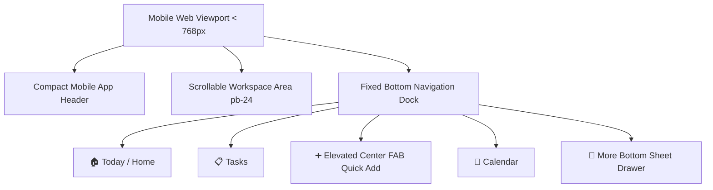

# 📱 Mobile Web UX & Responsiveness Revamp Plan

> **Goal**: Transform the **Orbit (Meraj-OS)** Web Application on mobile web browsers (`< 768px`) into a fluid, native-app-like experience. This includes a fixed bottom navigation dock, elevated floating action button (FAB), bottom-sheet module menu, compact top header, and touch-optimized layout spacing.

---

## 🎨 Mobile Architecture Overview

---

## 📅 Step-by-Step Actionable Implementation Plan & TODO Checklist

### Phase 1: Fixed Bottom Navigation Dock (`components/layout/BottomNav.tsx`)
- [x] **1.1 Create `components/layout/BottomNav.tsx`**
  - [x] Anchor container with `fixed bottom-0 left-0 right-0 z-40 h-16 md:hidden`.
  - [x] Style with frosted glass blur (`backdrop-blur-xl bg-white/85 dark:bg-[#0A0F1D]/90 border-t border-gray-200/80 dark:border-gray-800/80`).
  - [x] Add iOS/Android safe area bottom inset padding (`pb-[env(safe-area-inset-bottom)]`).
- [x] **1.2 Build Navigation Tabs & Active State Highlight**
  - [x] 🏠 **Today / Home**: Link to `/today` (Icon: `Sun` or `Sparkles`).
  - [x] 📋 **Tasks**: Link to `/tasks` (Icon: `CheckSquare`).
  - [x] 📅 **Calendar**: Link to `/calendar` (Icon: `CalendarIcon`).
  - [x] 📱 **More**: Trigger button to slide up `MobileMoreSheet`.
  - [x] Highlight active route with `text-orbit-blue` and `bg-orbit-blue/10` active pill indicator.
- [x] **1.3 Build Elevated Floating Action Button (FAB)**
  - [x] Center elevated quick add button (`bg-orbit-blue text-white p-3.5 rounded-full shadow-lg shadow-orbit-blue/40 -translate-y-4 border-4 border-white dark:border-[#0A0F1D] active:scale-90 transition-transform`).
  - [x] On click, open `QuickAddModal` (or trigger quick capture).

---

### Phase 2: Slide-Up Mobile Sheet Drawer ("More" Menu) (`components/layout/MobileMoreSheet.tsx`)
- [x] **2.1 Create `components/layout/MobileMoreSheet.tsx`**
  - [x] Build spring-animated slide-up modal using `framer-motion` (`AnimatePresence`).
  - [x] Include backdrop overlay and swipe-down handle bar (`w-12 h-1.5 rounded-full bg-gray-300 dark:bg-gray-700 mx-auto my-2`).
- [x] **2.2 Construct Module Grid (Touch Tiles)**
  - [x] Render 2-column or 3-column responsive touch tiles:
    - 🎓 **Career & DSA** (`/career`)
    - 🔬 **Research Projects** (`/research`)
    - 🎯 **Habits Tracker** (`/habits`)
    - 💼 **Clients & Freelance** (`/clients`)
    - 📝 **Notes & Inbox** (`/notes`)
    - 📊 **Analytics** (`/analytics`)
    - 📅 **Weekly Planner** (`/weekly-planner`)
    - 🎯 **Goals Tracker** (`/goals`)
    - 🔗 **Saved Links** (`/links`)
    - ⚙️ **Settings & Preferences** (`/settings`)
- [x] **2.3 Integrate Header & Quick Actions**
  - [x] User profile header with Google Sync status pill.
  - [x] Quick theme toggle button (Light / Dark mode).

---

### Phase 3: Compact Mobile App Header (`components/layout/Navbar.tsx`)
- [x] **3.1 Optimize Mobile Header Bar Layout**
  - [x] Set compact mobile navbar height (`h-14 md:h-16`).
  - [x] Hide desktop-only expanded search bar text (`hidden md:flex`).
  - [x] Display compact Orbit brand logo and active page indicator title.
- [x] **3.2 Touch Action Buttons**
  - [x] Search trigger icon (`Search`) for `GlobalSearchModal`.
  - [x] Focus mode trigger icon (`Zap` / `PanelRight`) for `FocusOverlayModal`.
  - [x] User profile trigger menu.

---

### Phase 4: Main Layout Integration & Safe Area Adjustments (`components/layout/MainLayout.tsx`)
- [x] **4.1 Connect `BottomNav` and `MobileMoreSheet` in `MainLayout.tsx`**
  - [x] Add state `mobileMoreSheetOpen` in `MainLayout.tsx`.
  - [x] Render `<BottomNav>` and `<MobileMoreSheet>` at layout root.
- [x] **4.2 Add Workspace Scroll Padding**
  - [x] Update main container padding to `pb-24 md:pb-6` so main page scrolling is never clipped by the bottom dock bar.
- [x] **4.3 Configure Viewport & Touch CSS**
  - [x] Verify `viewportFit: 'cover'` in `app/layout.tsx`.
  - [x] Add touch utilities (`active:scale-95`, `-webkit-tap-highlight-color: transparent`) in `app/globals.css`.

---

### Phase 5: Page-Level Mobile UX Polish
- [x] **5.1 Today Tasks & Timeline (`app/today/page.tsx`)**
  - [x] Ensure timeline view and priority task cards scale cleanly without horizontal scroll on mobile.
- [x] **5.2 Task Management (`app/tasks/page.tsx`)**
  - [x] Optimize Kanban board / List view column layout for mobile touch scrolling.
- [x] **5.3 Notes & Knowledge Base (`app/notes/page.tsx`)**
  - [x] Stack note navigation list and markdown editor vertically on mobile.
- [x] **5.4 Career & DSA Tracker (`app/career/page.tsx`)**
  - [x] Ensure DSA problem table headers and topic checklists are fully readable on mobile viewports.

---

### Phase 6: Build Verification & Testing
- [x] **6.1 Code Audit & Production Build**
  - [x] Verify responsive layout across mobile viewport sizes (`375px`, `390px`, `414px`).
  - [x] Run `npm run build` to confirm zero TypeScript or JSX build errors.
