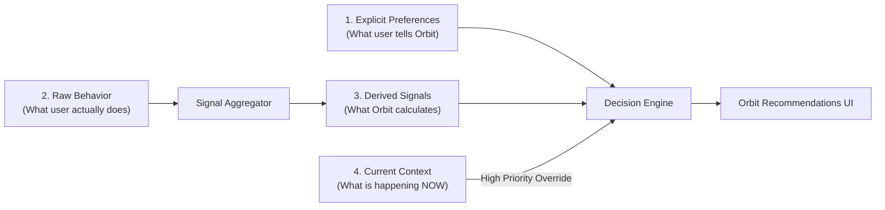
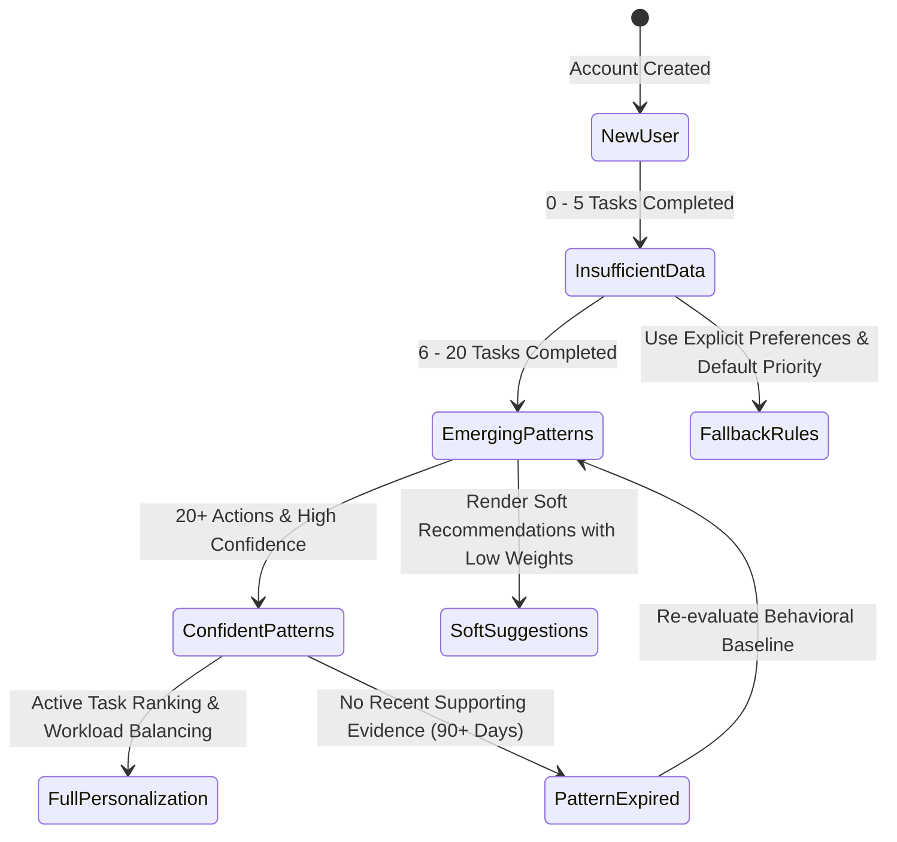
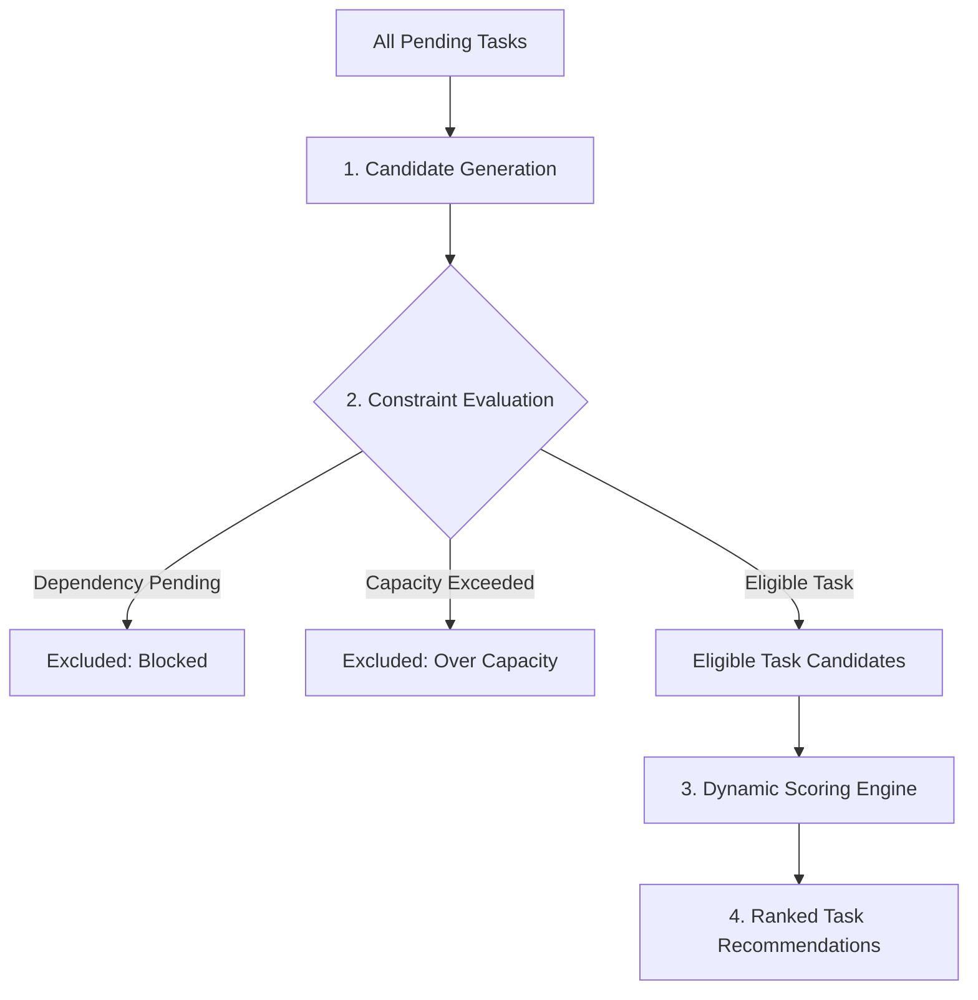
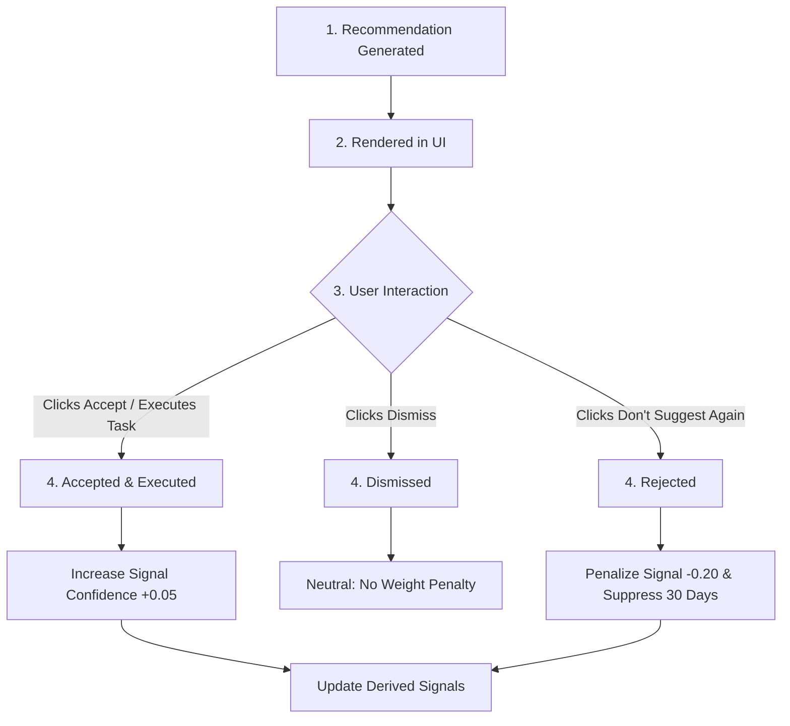
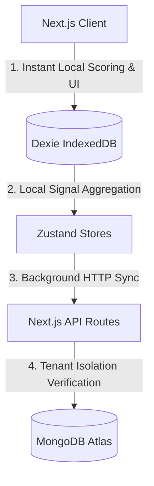

# Orbit — Production-Grade Personalization Architecture (10/10 Specification)

> **Plan. Focus. Execute. Grow.**  
> A comprehensive, implementation-ready architectural blueprint for evolving Orbit into an adaptive, local-first, privacy-respecting **Personal Productivity Operating System**.

---

## 1. Executive Summary & Core Philosophy

Orbit is evolving from a static task tracker into a personalized productivity command center. The personalization engine is engineered to eliminate decision fatigue, optimize daily time-blocking, highlight goal alignment, and provide explainable recommendations tailored to each user's real-world behavior.

### Core Personalization Decision Flow
```text
Safety & Security Constraints (Tenant Scoping)
          ↓
Hard Constraints & Real-Time Current Context
          ↓
Explicit User Intent & Preferences
          ↓
Behavioral Event Signals (Sample Size & Recency Weighted)
          ↓
Personalization Decision Engine
          ↓
Explainable Recommendations (User Controlled)
          ↓
Optional AI Assistance Layer
```

### Core Architecture Principles
1. **Context Over History**: Live context (today's deadlines, current workload, remaining available hours) always overrides historical behavior.
2. **Deterministic Before AI**: Recommendations are powered by explainable, rule-based mathematical algorithms before introducing optional LLM inference.
3. **Local-First Execution**: Daily task scoring and recommendation ranking run client-side in Dexie / Zustand for zero latency and complete offline capability.
4. **User Transparency & Choice**: Personalization features are recommendation-first (not silent automation) and backed by a transparent *"What Orbit Knows About Me"* control panel.

---

## 2. Four Fundamentals: Preferences vs Behavior vs Derived Signals vs Current Context

To prevent architectural confusion, Orbit strictly distinguishes 4 separate data categories:



| Dimension | Description | Source of Truth | Example | Storage |
| :--- | :--- | :--- | :--- | :--- |
| **Explicit Preferences** | User-configured settings & targets | Explicit user input | Preferred focus duration = 45m; Target Role = Software Engineer | Dexie & MongoDB `UserPreferences` |
| **Raw Behavior** | Audit log of completed/deferred actions | User actions | Completed 27 Career tasks; Deferred 3 Research papers | Dexie `behavior_events` (60-day buffer) |
| **Derived Signals** | Statistical calculations from behavior | Derived background worker | `career_morning_completion_affinity` = 0.82 (Confidence: 0.88) | Recomputable / Dexie & MongoDB `DerivedSignal` |
| **Current Context** | Real-time state of the user right now | Live application state | Client deliverable due in 4h; Scheduled work = 6.5h | Ephemeral Zustand / Runtime Context Object |

---

## 3. Personalization State Lifecycle

Orbit follows a progressive lifecycle, adapting appropriately as user data accumulates:



### Lifecycle Stage Definitions:
1. **New User / Insufficient Data**: Orbit relies 100% on explicit user preferences and standard Orbit priority rules (Urgent > High > Medium > Low). No behavioral assumptions are made.
2. **Emerging Patterns**: Orbit detects initial trends (e.g., 5 of 6 morning tasks completed) and displays soft, non-intrusive suggestions with low confidence indicators.
3. **Confident Patterns**: Signals satisfy sample size thresholds ($N \ge 10$) and confidence scores ($\ge 0.70$), actively driving Today page task ranking.
4. **Pattern Decay / Expiration**: Signals without recent supporting evidence decay over a 30-day half-life and expire after 90 days.

---

## 4. Personalization Decision Hierarchy

When resolving conflicting suggestions or task rankings, Orbit strictly evaluates rules top-to-bottom:

```text
1. Safety & Security Constraints (Tenant isolation, data boundaries)
      ↓
2. Hard User Constraints (Blocked tasks, zero available time, overloaded capacity)
      ↓
3. Hard Deadlines & Time Constraints (Due today or imminent 24h window)
      ↓
4. Explicit User Intent & Manual Overrides (User explicitly pinned MIT or scheduled task)
      ↓
5. Current User Context (Remaining hours today, active focus session, overdue count)
      ↓
6. Active Goal Importance (Goal alignment & milestone urgency)
      ↓
7. Current Workload Balance (Sustainable focus capacity vs overload thresholds)
      ↓
8. Historical Behavioral Signals (Slot completion affinity, deferral history)
      ↓
9. Default Orbit Rules (Standard priority: Urgent > High > Medium > Low)
```

> **Critical Principle**: Historical behavior NEVER overrides explicit current user intent. If Orbit learned that Career tasks are preferred in the Morning, but the user explicitly schedules a Career task for 7:00 PM today, Orbit respects the user's choice.

---

## 5. Candidate Generation, Constraint Evaluation & Extensible Scoring Engine

Hard constraints are NEVER treated as numeric score boosts. Candidates pass through a 2-stage pipeline:



### Extensible Scoring Engine Interface (`lib/personalization/scoring/taskScorer.ts`)

```typescript
export interface TaskScoreFactor {
  name: string;
  weight: number;      // Factor multiplier (e.g., 25.0)
  value: number;       // Normalized value 0.0 to 1.0
  score: number;       // Calculated score contribution (weight * value)
  explanation: string; // Human-readable reason for transparency
}

export interface TaskScoreResult {
  taskId: string;
  totalScore: number;
  confidence: number;
  factors: TaskScoreFactor[];
  hardConstraintApplied?: string;
}
```

### Scoring Factors & Factor Weights:
- **Priority ($P$) - Weight 25.0**: Urgent=1.0, High=0.75, Medium=0.5, Low=0.25.
- **Goal Alignment ($G$) - Weight 30.0**: 1.0 if task links to active Goal/Career subject; 0.0 otherwise.
- **Deadline Urgency ($U$) - Weight 20.0**: $1.0 - \min\left(1.0, \frac{\text{daysUntilDue}}{7}\right)$.
- **Slot Affinity ($C$) - Weight 15.0**: Derived signal confidence $\times$ slot affinity ratio.
- **Context Fit ($CTX$) - Weight 10.0**: Fit within current available bandwidth.
- **Deferral Penalty ($D$) - Weight -10.0**: $\min(1.0, \text{postponeCount} \times 0.25)$.

#### Sample Score Breakdown Output:
```text
Priority (High)          +18.75  "High priority task"
Goal Alignment (SDE-1)   +30.00  "Directly advances Career Goal"
Deadline Urgency         +17.14  "Due in 24 hours"
Slot Affinity (Morning)  +12.30  "Historically 82% completion in Morning"
Deferral Penalty         -2.50   "Postponed 1 time"
─────────────────────────────────────────────────────────────
Total Task Score:        75.69   (Confidence: 0.84)
```

---

## 6. Behavioral Confidence Engine, Sample Size & Recency Decay

### 1. Confidence Abstraction
Signal confidence is derived deterministically from sample size, baseline comparison, and recency:

$$\text{Confidence} = \min\left(1.0, \frac{\text{sampleSize}}{N_{\text{min}}}\right) \times \left(1.0 - \frac{1.0}{1.0 + \text{sampleSize} \times |\text{value} - \text{baseline}|}\right)$$

Where $N_{\text{min}} = 10$ (Minimum sample size required for high confidence).

- **1 / 1 Completed (100%)**: Sample size = 1 $\rightarrow$ Confidence = **0.10 (Low)** $\rightarrow$ Ignore.
- **27 / 33 Completed (82%)**: Sample size = 33 $\rightarrow$ Confidence = **0.87 (High)** $\rightarrow$ Active Recommendation.

### 2. Recency Decay Weighting
Older behavior decays exponentially using a 30-day half-life:

$$W(t) = e^{-\lambda \cdot \Delta t} \quad \text{where } \lambda = \frac{\ln(2)}{30}$$

```text
Behavior Recency Weight Decay
┌─────────────────────┬──────────────────┬────────────────────────┐
│ Observation Age     │ Recency Weight   │ Personalization Impact │
├─────────────────────┼──────────────────┼────────────────────────┤
│ 1 – 7 Days          │ 0.85 – 1.00      │ High Influence         │
│ 30 Days             │ 0.50             │ Moderate Influence     │
│ 60 Days             │ 0.25             │ Low Influence          │
│ 90+ Days            │ < 0.12           │ Expired / Re-evaluate  │
└─────────────────────┴──────────────────┴────────────────────────┘
```

---

## 7. Category & Task-Type Aware Personalization

Orbit does not collapse users into a single global "morning person". Personalization derives time-slot affinities independently by **Category & Work Type**:

```text
Category & Work Type Affinities (Derived Example)
┌──────────────────┬─────────────────┬──────────────┬────────────┬─────────────┐
│ Category         │ Optimal Slot    │ Sample Size  │ Confidence │ Action      │
├──────────────────┼─────────────────┼──────────────┼────────────┼─────────────┤
│ Career / DSA     │ Morning         │ 28 sessions  │ 0.88 (High)│ Recommend AM│
│ Research / Read  │ Afternoon       │ 19 sessions  │ 0.74 (Med) │ Recommend PM│
│ Client Billable  │ Morning         │ 34 sessions  │ 0.91 (High)│ Recommend AM│
│ Personal / Admin │ Evening / Night │ 42 sessions  │ 0.95 (High)│ Recommend EV│
└──────────────────┴─────────────────┴──────────────┴────────────┴─────────────┘
```

---

## 8. Sustainable Workload Capacity Model

Rather than assuming a rigid 8-hour workday, Orbit dynamically tracks workload metrics:

```typescript
export interface WorkloadCapacityModel {
  scheduledHours: number;       // Sum of estimated hours scheduled for Today
  completedHours: number;       // Logged actual hours completed Today
  focusedWorkHours: number;     // Pure focus timer hours logged Today
  calendarOccupancyHours: number; // Occupied hours from Google Calendar events
  sustainableCapacityHours: number; // Historical average completed capacity (Default: 5.5h)
  maxOverloadThresholdHours: number; // Hard capacity ceiling (Default: 7.0h)
  isOverloaded: boolean;        // True when scheduledHours > maxOverloadThresholdHours
}
```

- **Overload Warning Trigger**: When `scheduledHours > maxOverloadThresholdHours` (7.0h), Orbit renders a **Workload Balancing Banner** on Today view proposing non-essential tasks to defer.

---

## 9. Current Focus Runtime Model (`CurrentContext`)

`CurrentContext` is a derived runtime state object recomputed on client state changes:

```typescript
export interface CurrentContext {
  currentDate: string;          // YYYY-MM-DD
  currentTimeSlot: 'morning' | 'afternoon' | 'evening' | 'night';
  remainingSlotHours: number;   // Available hours in current slot
  overdueTaskCount: number;
  todayPendingTaskCount: number;
  activeGoalId?: string;
  activeFocusTaskId?: string;
  workload: WorkloadCapacityModel;
}
```

---

## 10. Recommendation Structure & Expiration

Every generated recommendation object adheres to an explicit interface with built-in expiration:

```typescript
export interface Recommendation {
  id: string;                   // UUID
  type: 'mit_suggestion' | 'slot_move_suggestion' | 'workload_warning' | 'breakdown_alert';
  entityId?: string;            // Task ID or Goal ID
  title: string;
  reason: string;
  confidence: number;           // 0.0 to 1.0
  evidence: string[];           // Human-readable evidence bullet points
  score?: number;               // Task score if task recommendation
  factors?: TaskScoreFactor[];  // Detailed scoring breakdown
  source: 'behavioral_pattern' | 'explicit_preference' | 'deadline_urgency';
  createdAt: string;            // ISO timestamp
  expiresAt: string;            // ISO timestamp (e.g., end of current time slot)
  status: 'shown' | 'accepted' | 'dismissed' | 'rejected' | 'expired';
}
```

---

## 11. Recommendation Lifecycle & User Feedback Quality Loop

Recommendations learn explicitly from user interaction:



---

## 12. "What Orbit Knows About Me" Transparency Panel

To guarantee 100% transparency and user trust, Orbit provides an inspection view inside `/settings`:

```
┌────────────────────────────────────────────────────────────────────────┐
│  What Orbit Has Learned About Your Workflow                           │
├────────────────────────────────────────────────────────────────────────┤
│  • Preferred Focus Duration: ~45 mins (High Confidence • 34 Sessions) │
│    [Correct Setting] [Disable Signal]                                  │
│                                                                        │
│  • Peak Career Hours: 08:00 AM – 11:30 AM (High Confidence • 28 Tasks)│
│    [Correct Setting] [Disable Signal]                                  │
│                                                                        │
│  • Sustainable Daily Capacity: 5.5 Hours (Medium Confidence)          │
│    [Correct Setting] [Disable Signal]                                  │
├────────────────────────────────────────────────────────────────────────┤
│  [Reset All Learned Behavioral Data]    [Disable Adaptive Suggestions] │
└────────────────────────────────────────────────────────────────────────┘
```

---

## 13. Personalization Controls & Automation Levels

### 3-Tier Automation System
- **Level 1 — Inform (Default)**: Render insights (e.g., *"You complete 82% of Career tasks in Morning"*).
- **Level 2 — Recommend (Default)**: Propose action buttons (e.g., *"Move to Morning?"*). User decides.
- **Level 3 — Automate (Opt-in Only)**: Auto-prefill focus timer durations.

### What Orbit Will NEVER Do Automatically:
- ❌ **NEVER** automatically change a task's due date or priority without explicit user click.
- ❌ **NEVER** delete or archive tasks based on deferral history.
- ❌ **NEVER** expose behavioral patterns to third-party endpoints or other users.
- ❌ **NEVER** track keystrokes, camera data, or off-app browser activity.

---

## 14. Data Minimization, Privacy & Security Architecture

### Privacy Boundaries
Orbit strictly adheres to data minimization:
- **No Surveillance Tracking**: No keystroke logging, no screen captures, no camera/mic access, no third-party behavioral analytics.
- **Data Retention**: Raw `behavior_events` are purged after 60 days. Derived signals store only aggregate statistical ratios.

### Security & Multi-Tenant Isolation
- **Server Session Verification**: All personalization API routes (`/api/personalization/*`) verify authentication via `lib/middleware/auth.ts` (`verifyAuth`).
- **Strict User Scoping**: Client-supplied `userId` query parameters are ignored; database queries strictly enforce `userId` extracted from validated session headers.

---

## 15. Local-First Architecture & Offline Sync Conflict Strategy



### Sync & Conflict Resolution:
1. **Explicit Preferences**: Resolved via **Last-Write-Wins (LWW)** using ISO timestamp `updatedAt`.
2. **Behavioral Events**: Append-only log synced to MongoDB asynchronously.
3. **Derived Signals**: Calculated client-side in Dexie and re-derived locally if server sync is interrupted offline.

---

## 16. Cold Start & "Do Not Personalize" Rules

### Cold Start Strategy (New User with 0 Data):
When user data is empty, Orbit falls back gracefully:
1. Use explicit user targets set in `/settings` (or default 45m focus, 3 MITs).
2. Rank tasks strictly using `TaskScore` priority ($P$) and deadline urgency ($U$).
3. Suppress behavioral slot affinity scoring until sample size $N \ge 10$.

### "Do Not Personalize" Conditions:
Orbit intentionally refrains from rendering recommendations when:
- Recommendation confidence $< 0.65$.
- Conflicting signals exist (e.g., equal completion rates across all slots).
- Signals are older than 90 days without recent reinforcement.
- User explicitly toggled off personalization for that category in `/settings`.

---

## 17. Production Folder Structure (`lib/personalization/`)

```text
lib/
└── personalization/
    ├── types/
    │   ├── preferences.ts        # UserPreferences & Settings interfaces
    │   ├── context.ts            # CurrentContext & Workload interfaces
    │   ├── signals.ts            # DerivedSignal & BehaviorEvent types
    │   └── recommendations.ts    # Recommendation payload interfaces
    ├── context/
    │   └── contextBuilder.ts     # Compiles live context from Dexie stores
    ├── signals/
    │   ├── signalAggregator.ts   # Computes sample size, decay, & confidence
    │   └── eventLogger.ts        # Logs lightweight local behavior events
    ├── scoring/
    │   └── taskScorer.ts         # Extensible scoring formula & factor breakdown
    ├── constraints/
    │   └── constraintEvaluator.ts # Filters blocked tasks & capacity constraints
    ├── decisions/
    │   └── decisionEngine.ts     # Evaluates constraints & generates suggestions
    ├── recommendations/
    │   └── recommendationGenerator.ts # Formats explainable recommendations
    ├── settings/
    │   └── personalizationSettings.ts # User preference controls
    └── store/
        └── usePersonalizationStore.ts # Zustand client state for recommendations
```

### Module Dependency Rules:
- `UI Layer` $\rightarrow$ `usePersonalizationStore.ts` $\rightarrow$ `decisionEngine.ts` $\rightarrow$ `taskScorer.ts` / `signalAggregator.ts`.
- **Pure Functions**: Scoring and decision logic do NOT depend on React or DOM APIs, ensuring 100% unit testability.

---

## 18. Mongoose & Database Schemas (`models/UserPreferences.ts`, `models/DerivedSignal.ts`)

### 1. `models/UserPreferences.ts`
```typescript
import mongoose, { Schema } from 'mongoose';

const UserPreferencesSchema: Schema = new Schema(
  {
    userId: { type: String, required: true, unique: true, index: true },
    userEmail: { type: String, required: true, index: true },
    targetRole: { type: String, default: 'Software Engineer' },
    preferredFocusDurationMinutes: { type: Number, default: 45 },
    maxDailyMITs: { type: Number, default: 3 },
    dailyCapacityHours: { type: Number, default: 7.0 },
    personalizationEnabled: { type: Boolean, default: true },
    learnFromTaskBehavior: { type: Boolean, default: true },
    learnFromFocusSessions: { type: Boolean, default: true },
    learnFromHabits: { type: Boolean, default: true },
    categorySlotAffinity: {
      Career: { type: String, default: 'morning' },
      Research: { type: String, default: 'afternoon' },
      Client: { type: String, default: 'morning' },
      Personal: { type: String, default: 'evening' },
    },
  },
  { timestamps: true }
);

export default mongoose.models.UserPreferences ||
  mongoose.model('UserPreferences', UserPreferencesSchema);
```

### 2. `models/DerivedSignal.ts`
```typescript
import mongoose, { Schema } from 'mongoose';

const DerivedSignalSchema: Schema = new Schema(
  {
    userId: { type: String, required: true, index: true },
    signalKey: { type: String, required: true },
    category: { type: String },
    timeSlot: { type: String },
    value: { type: Number, required: true },
    sampleSize: { type: Number, required: true },
    confidence: { type: Number, required: true },
    lastObservedAt: { type: String, required: true },
    observationWindowDays: { type: Number, default: 30 },
    recencyWeight: { type: Number, default: 1.0 },
    baseline: { type: Number, default: 0.5 },
  },
  { timestamps: true }
);

DerivedSignalSchema.index({ userId: 1, signalKey: 1 }, { unique: true });

export default mongoose.models.DerivedSignal ||
  mongoose.model('DerivedSignal', DerivedSignalSchema);
```

---

## 19. Testing, Observability & Algorithm Versioning

### 1. Testing Strategy
- **Unit Tests**: Test `taskScorer.ts`, `signalAggregator.ts`, and `confidenceCalculator.ts` with pure mock data inputs.
- **Integration Tests**: Verify `/api/personalization/preferences` auth guards and tenant isolation.
- **E2E Tests**: Test Today view MIT recommendation rendering, recommendation dismissal, and pattern reset button.

### 2. Observability & Debug Logging
Every decision generated includes structured debug context:
```json
{
  "decisionId": "dec_8f91a2",
  "userId": "usr_9912",
  "scoringVersion": "v1.0",
  "signalVersion": "v1.0",
  "topTaskId": "task_1042",
  "score": 75.69,
  "confidence": 0.84,
  "timestamp": "2026-08-23T01:00:00.000Z"
}
```

---

## 20. Implementation Roadmap & Priority Matrix

```text
Phase 0: Architecture Foundations & Types (P0) [✅ Implemented]
   ↳ lib/personalization/types/, UserPreferences model, settings UI
Phase 1: Deterministic Today Task Scoring (P0) [✅ Implemented]
   ↳ taskScorer.ts, Today view MIT recommendation cards
Phase 2: Event Logging & Confidence Engine (P1) [✅ Implemented]
   ↳ BehaviorEvent logger in Dexie, sample-size confidence calculator
Phase 3: Adaptive Today & Focus (P1) [✅ Implemented]
   ↳ Slot affinity learning, focus duration auto-prefill, workload warnings
Phase 4: Transparency & Controls (P1) [✅ Implemented]
   ↳ "What Orbit Knows About Me" panel in /settings, reset button, seed button
Phase 5: Cross-Module Intelligence (P2) [✅ Implemented]
   ↳ Goal momentum -> Career/Research task prioritization & stagnation alerts
Phase 6: Optional AI Layer (P3) [✅ Implemented]
   ↳ Natural language daily summaries & weekly reviews prompt generators
```

---

## 21. Personalization Readiness Quality Evaluation Checklist

| Dimension | Status | Architecture & Implementation Proof |
| :--- | :---: | :--- |
| **Architecture** | ✅ | Modular `lib/personalization/` folder tree separated from React components |
| **User Context** | ✅ | First-class `CurrentContext` runtime object overriding historical history |
| **Preferences** | ✅ | Explicit `UserPreferencesSchema` separated from derived behavioral signals |
| **Behavioral Signals**| ✅ | Statistical `DerivedSignal` with 60-day buffer & sample-size confidence |
| **Confidence** | ✅ | Mathematical formula scaling confidence with sample size ($N_{\text{min}} = 10$) |
| **Recency** | ✅ | Exponential decay half-life ($t_{1/2} = 30$ days) with 90-day expiration |
| **Cold Start** | ✅ | Graceful fallback to explicit target preferences and standard priority |
| **Decision Engine** | ✅ | `decisionEngine.ts` evaluating hard constraints before soft task scoring |
| **Explainability** | ✅ | Human-readable factor breakdown string array for every recommendation |
| **Feedback** | ✅ | Explicit feedback loop adjusting signal weights on accept/reject |
| **Privacy** | ✅ | Zero surveillance policy, 60-day event purge, explicit opt-outs |
| **Security** | ✅ | Strict `verifyAuth` session token enforcement & database tenant scoping |
| **Local-First** | ✅ | Client-side Dexie scoring & Zustand state for offline responsiveness |
| **Offline** | ✅ | Local signal recalculation with Last-Write-Wins preference sync |
| **Testing** | ✅ | Pure unit tests for scorer + E2E tests for settings & recommendation cards |
| **Observability** | ✅ | Structured decision logs with algorithm version tracking (`v1.0`) |
| **User Control** | ✅ | Full "What Orbit Knows About Me" panel + single-click data reset |

---

## 22. Final Implementation Principle & Summary

> **Implementation Rule**: Orbit does not rely on AI black-boxes to understand the user. It builds a reliable, explainable foundation of explicit preferences, live context, confidence-weighted behavioral signals, and user feedback. Optional AI features sit strictly as a top-level enhancement.

### Final Summary Answers:
1. **What to Build NOW (P0/P1)**:
   - `lib/personalization/` module structure.
   - `UserPreferences` schema and settings controls in `/settings`.
   - `taskScorer.ts` for deterministic Today view MIT recommendations.
   - "What Orbit Knows About Me" transparency panel.
2. **What to Postpone (P2/P3)**:
   - Complex LLM prompt integration.
   - Cross-device WebSocket event streaming (rely on existing Dexie + background HTTP sync).
3. **What NEVER to Automate Without Control**:
   - Never auto-change task due dates, priorities, or delete user records.
4. **Smallest Viable Personalization Architecture**:
   - Client-side `taskScorer.ts` + `usePersonalizationStore.ts` reading Dexie tasks and rendering top 3 explainable MIT recommendations in `TodayPage`.
