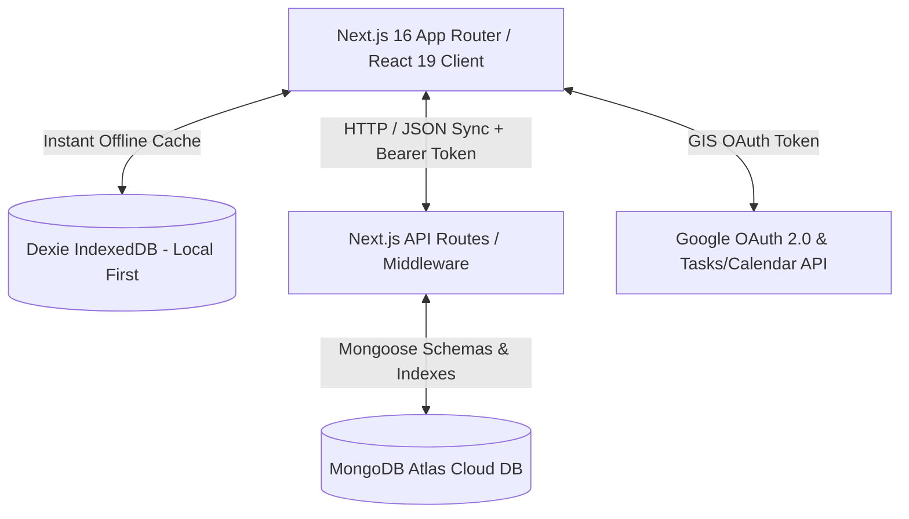

# Orbit — Personal Productivity Command Center

> **Plan. Focus. Execute. Grow.**  
> Orbit is an all-in-one personal productivity operating system designed for high performers, researchers, engineers, and students to seamlessly organize daily workflows, track long-term goals, manage research papers, hone career skills, and sync across Google Workspace with local-first speed.

---

## 🎯 Executive Summary & Mission

Orbit bridges the gap between daily task execution and long-term career growth. Unlike traditional task managers that focus strictly on to-do items, Orbit acts as a unified **Productivity Command Center** combining:

- **Time-Block Planning & Focus Mode** (Structured daily timeline across 4 time slots)
- **Goal & Habit Tracker** (Daily score calculation & streak tracking)
- **Client & Project Manager** (Freelance & project status boards)
- **Research & Thesis Hub** (Academic paper tracking & literature matrix)
- **Career & DSA Tracker** (Subject mastery trees & job application pipeline)
- **Local-First Speed with Cloud Sync** (Dexie IndexedDB + MongoDB Atlas)
- **Google Workspace Integration** (Bi-directional Google Tasks & Calendar sync)

---

## 🏗️ Architecture & Technology Stack

Orbit is built with modern web technologies, adhering to high-performance local-first paradigms and robust server-side security.



### Core Stack
- **Framework**: Next.js 16 (App Router with Turbopack) & React 19
- **Language**: TypeScript (Strict type checking)
- **Styling & UI**: Custom Vanilla CSS design system, Tailwind CSS utilities, Lucide React icons, Framer Motion animations
- **Charts & Visualization**: Highcharts & HighchartsReact (Dynamic client bundle loading)
- **State Management**: Zustand & Custom Local Stores

### Data & Persistence
- **Client-Side Storage**: Dexie.js (IndexedDB) for zero-latency UI interactions and offline support
- **Server Database**: MongoDB Atlas managed via Mongoose schemas
- **Form & Validation**: Zod schema validation for strict API payload verification

---

## 🧩 Core Modules & Features

### 1. Today & Focus Engine (`/today`)
- **4 Time-Slot Split**: Categorizes tasks into Morning (6 AM - 12 PM), Afternoon (12 PM - 5 PM), Evening (5 PM - 9 PM), and Night (9 PM - 12:30 AM).
- **Top 3 MITs**: Pinpoint the most critical tasks for maximum daily impact.
- **Smart Focus Card & Overlay Modal**: Distraction-free full-screen focus modal with built-in timer and task completion trigger.
- **Daily Score**: Real-time 0–100 score engine calculating task completion, habit consistency, active goals, and DSA practice.

### 2. Task Management & Smart Deduplication (`/tasks`)
- Filter tasks by category (*Client, Research, Career, Personal, College, Habit*) and priority (*Urgent, High, Medium, Low*).
- **Centralized Deduplication Engine (`lib/taskUtils.ts`)**: Prevents duplicate tasks during Google Tasks synchronization using composite key matching (`g_<googleTaskId>` or `t_<title>_<dueDate>`).

### 3. Google Workspace Calendar & Tasks Integration (`/calendar`)
- Bi-directional synchronization with Google Calendar and Google Tasks via Google Identity Services (GIS).
- Unified timeline view displaying both native Orbit tasks and imported Google Calendar events.

### 4. Career & DSA Tracker (`/career`)
- **DSA Practice View**: Topic-wise DSA tracking (Arrays, Trees, Graphs, Dynamic Programming) with problem counts and mastery badges.
- **Job Application Pipeline**: Visual kanban and table view tracking applications from *Applied*, *OA*, *Interview*, to *Offer*.

### 5. Research & Thesis Hub (`/research`)
- Organize research projects by domain.
- Maintain paper reading queues, pdf links, key findings, and citation matrices for thesis work.

### 6. Client Projects & CRM Light (`/clients`, `/projects`)
- Client profile management, billable project tracking, invoice logs, and deliverable status.

### 7. Habits & Goals (`/habits`, `/goals`)
- Habit daily check-ins with streak heatmaps.
- Goal tracking with percentage progress bars and linked sub-tasks.

### 8. Analytics & Daily History Log (`/analytics`)
- Automatic 11:45 PM daily snapshot logger compiling task completion rates, logged hours, category distribution, and habit records into MongoDB.
- Interactive Highcharts visualizations for productivity trends over time.

---

## 🔒 Security & Multi-Tenant Architecture

Orbit is engineered with tenant isolation and end-to-end user authentication:

1. **Authentication Middleware (`lib/middleware/auth.ts`)**:
   - Verifies incoming request headers (`Authorization: Bearer <token>`, `x-user-id`, `x-user-email`).
   - Validates Google OAuth tokens via `https://oauth2.googleapis.com/tokeninfo`.

2. **Data Tenant Isolation**:
   - Every API route (`/api/tasks`, `/api/events`, `/api/habits`, `/api/goals`, `/api/analytics`, etc.) enforces `userId` scoping.
   - Database queries strictly filter by `userId` to ensure complete data isolation between users.

3. **Mongoose Database Indexing**:
   - Compound indexes (`{ userId: 1, dueDate: 1 }`, `{ userId: 1, status: 1 }`, `{ userId: 1, startDate: 1 }`, `{ userId: 1, date: -1 }`) ensure fast query execution even under heavy database growth.

4. **Input Validation**:
   - Zod validation schemas (`lib/validations/schemas.ts`) validate all request body payloads prior to database operations.

---

## 📱 Mobile Responsiveness & PWA

- **Unified Navigation Header**: Dynamic header with responsive mobile drawer navigation, removing redundant sidebars on small screens.
- **Progressive Web App (PWA)**: Installable as a native app on iOS, Android, and Desktop via Web App Manifest and Service Worker registration (`PWARegister.tsx`).

---

## 💻 Developer Setup & Commands

### Prerequisites
- Node.js 18+ installed
- MongoDB instance (Local or Atlas)
- Google Cloud Console Project (OAuth Client ID)

### Environment Setup (`.env.local`)
Copy `.env.example` to `.env.local` and set required environment variables:
```env
MONGODB_URI=mongodb+srv://...
NEXT_PUBLIC_GOOGLE_CLIENT_ID=your-google-client-id.apps.googleusercontent.com
SMTP_HOST=smtp.gmail.com
SMTP_PORT=587
SMTP_USER=your-email@gmail.com
SMTP_PASS=your-app-password
```

### CLI Commands

```bash
# Install dependencies
npm install

# Run development server (Turbopack)
npm run dev

# Build production bundle & run TypeScript type checking
npm run build

# Start production server
npm start
```

---

## 📄 License & Maintainer

- **Maintainer**: Merajul Haque
- **Live URL**: [orbit.merajulhaque.com](https://orbit.merajulhaque.com)
