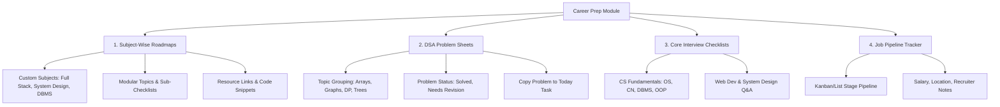

# Orbit Career Prep Module Redesign & Specification Document

## Executive Summary

The **Orbit Career Prep & Technical Study Tracker** is designed to empower developers and job seekers to systematically prepare for technical interviews, master Computer Science fundamentals, solve Data Structures & Algorithms (DSA) problems, and manage their job application pipeline.

This document synthesizes industry best practices from leading learning platforms—**FreeCodeCamp**, **ChaiCode (Hitesh Choudhary)**, **GeeksforGeeks**, and **Striver SDE Sheet (TakeUForward)**—to establish a comprehensive, subject-wise study plan architecture for Orbit.

---

## 1. Competitive Analysis & Benchmarking

| Platform | Core Strengths | Key UX/Feature Takeaways for Orbit |
| :--- | :--- | :--- |
| **FreeCodeCamp** | Milestone-driven tracks, step-by-step interactive checklists, project-based mastery. | **Module & Topic Checklists**: Breakdown subjects into modular sub-topics with clear checkbox gates. |
| **ChaiCode (Hitesh Choudhary)** | Hands-on project roadmaps, practical code exercises, subject-wise structured learning (JS, React, Node, DevOps). | **Subject-Wise Custom Plans**: Allow users to create top-level subjects (e.g., *Frontend*, *Backend*, *System Design*) with nested topics & notes. |
| **GeeksforGeeks** | CS Fundamentals coverage (DBMS, OS, Computer Networks), topic-wise theory & Q&A sheets. | **Core Subject Checklists**: Built-in curated checklists for OS, DBMS, Networks, and Web Security. |
| **Striver / NeetCode / LeetCode** | Topic-wise DSA sheets, difficulty categorization (Easy/Med/Hard), revision bookmarking. | **Granular DSA Problem Tracker**: Direct problem links, difficulty tags, solution notes, and revision flags. |

---

## 2. Proposed Module Architecture

The revamped Career Prep Module will feature 4 main tabs:



---

## 3. Detailed Data Models

### 3.1 Subject-Wise Study Plan (`SubjectPlan`)
Allows users to create top-level subjects (e.g. *Node.js Microservices*, *System Design*, *React Architecture*) with custom topics, external links, and sub-checklists.

```typescript
export interface SubjectTopicChecklist {
  id: string;
  title: string;
  completed: boolean;
}

export interface SubjectTopic {
  id: string;
  title: string;
  description?: string;
  difficulty?: 'Beginner' | 'Intermediate' | 'Advanced';
  status: 'todo' | 'in_progress' | 'mastered';
  resources?: { title: string; url: string }[];
  checklist: SubjectTopicChecklist[];
  notes?: string;
  lastRevised?: string;
}

export interface SubjectPlan {
  id: string;
  title: string;          // e.g. "Full Stack Web Development", "System Design"
  category: string;       // e.g. "Web Dev", "CS Fundamentals", "DevOps", "Database"
  description?: string;
  colorTheme?: string;    // Accent theme for card header
  topics: SubjectTopic[];
  createdAt: string;
  updatedAt: string;
}
```

### 3.2 Enhanced DSA Problem Sheet (`DSASheetProblem`)
```typescript
export interface DSAPrimaryTopic {
  id: string;
  name: string;           // e.g. "Arrays & Hashing", "Dynamic Programming", "Graphs"
  category: string;
  problems: {
    id: string;
    title: string;
    leetcodeUrl?: string;
    difficulty: 'Easy' | 'Medium' | 'Hard';
    completed: boolean;
    needsRevision: boolean;
    solutionNotes?: string;
    codeSnippet?: string;
  }[];
}
```

---

## 4. Key Functional Features to Implement

### Feature 1: Subject-Wise Plan & Topic Builder
* **Custom Subject Creation**: Users can create custom subjects (e.g., *"System Design & Distributed Systems"*).
* **Topic & Checklist Editor**: Add topics under each subject with granular checklist items, video/docs links (FreeCodeCamp, GFG, ChaiCode, YouTube), and Markdown notes.
* **Progress Tracking**: Automatic subject completion % based on completed checklist items.

### Feature 2: Built-in Curated Roadmaps (Presets)
Pre-populated subject plans that users can import with one click:
1. **Frontend Engineer Masterclass** (HTML/CSS, JS Event Loop, React Internals, Next.js App Router, Performance).
2. **Backend & System Design Roadmap** (Node.js Architecture, REST/gRPC, SQL vs NoSQL, Caching, Load Balancing).
3. **CS Fundamentals Core Sheet** (Operating Systems, Database Management Systems, Computer Networks, OOP Concepts).

### Feature 3: Granular DSA Problem Sheets
* Problem-level granularity with **Difficulty Badges** (`Easy`, `Medium`, `Hard`).
* **"Needs Revision" Flag**: Bookmark complex problems for weekend review.
* **"Copy Problem to Task" Button**: Seamlessly copy a target DSA problem directly into Orbit's **Today Task** list for the morning focus block.

### Feature 4: Comprehensive Interview Q&A Checklists
* Subject-grouped interview questions with toggleable answers, code snippets, and mastery checkmark.

---

## 5. UI/UX Design Specifications

- **Header Banner**: Dynamic statistics pill showing total subjects created, overall completion rate, solved DSA count, and active job applications.
- **Tab Layout**: Smooth tab switcher using `framer-motion` for transitions between **Subjects & Roadmaps**, **DSA Sheets**, **Interview Q&A**, and **Job Pipeline**.
- **Subject Cards**: Clean cards displaying category badges, progress bars, topic counts, expandable sub-topic checklists, and quick resource links.
- **Dark Mode Parity**: Styled using Orbit's design tokens (`bg-background`, `btn-primary`, `#1F3B99` / `#6D5BFF` dark mode accents).

---

## 6. Phased Implementation Roadmap

| Phase | Deliverable | Scope |
| :--- | :--- | :--- |
| **Phase 1** | Data Model & Store Update | Update `types/index.ts`, `useCareerStore.ts`, and `/api/career/route.ts` to support `SubjectPlan` CRUD and updated DSA sheets. |
| **Phase 2** | Subject-Wise Plan Builder UI | Build `SubjectPlanCard`, `TopicModal`, and preset curriculum importers in `app/career/page.tsx`. |
| **Phase 3** | Enhanced DSA & Problem Sheets | Refactor DSA Tracker tab with individual problem checklists, links, and "Copy to Task" integration. |
| **Phase 4** | Integration & Polish | Connect with Orbit Today module, test offline persistence, and verify complete mobile responsiveness. |

---

> [!TIP]
> **Open Question for User**: Would you like to start by implementing **Phase 1 & Phase 2** (the Subject-Wise Plan Builder & Preset Curriculums), or should we build the entire redesigned module in one step?
