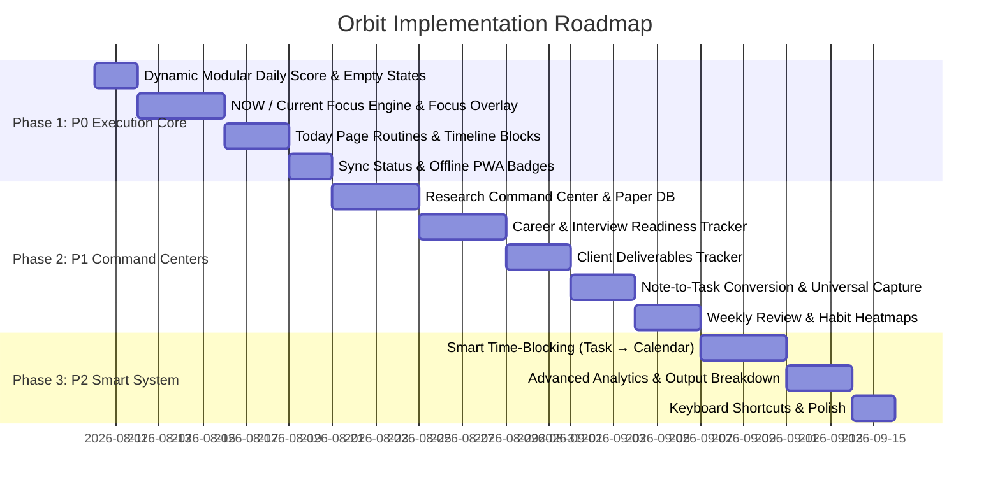

# Orbit Implementation Plan — Personal Productivity Command Center

Based on the product audit and feature recommendations in [`docs/Analyze.md`](file:///e:/meraj-os/docs/Analyze.md), this document outlines a structured, phase-wise implementation plan and detailed TODO checklist to transform **Orbit** into an intelligent personal execution system.

---

## 🎯 Strategic Objective
Shift Orbit from a static todo & tracking dashboard into an **active execution engine** that answers:
> *"What should I be doing right now, how much time do I have, and am I executing on what matters most?"*

---

## 📅 Roadmap Overview

---

## 🔴 Phase 1: P0 — Execution Core & Productivity Intelligence

### 1.1 Dynamic & Modular Daily Score Engine & Empty State Guard
* **Problem**: 0 tasks remaining currently calculates as 100/100 score on empty days. Hardcoded category percentages fail in a modular app where users have different active modules.
* **Modular Solution**:
  - **Core Task & MIT Execution (40% Base Weight)**: Standard task completion (60% weight) + MIT completion boost (40% weight).
  - **Dynamic Active Modules Weight (60% Dynamic Weight)**: Evenly distributed across the user's active modules (`habits`, `goals`, `clients`, `research`, `career`).
  - **Empty-State Guard**: Return `0` or `"No activity logged yet"` on days with zero recorded tasks/habits/goals.

### 1.2 "NOW" / Current Focus Section & Focus Mode Overlay
* **Location**: Top of Dashboard (`app/page.tsx`) & Today page (`app/today/page.tsx`).
* **Components**:
  - `NowFocusCard`: Displays current active task/schedule block, progress bar, time remaining, and a prominent **`▶ Start Focus`** button.
  - `FocusOverlayModal`: Fullscreen distraction-free timer overlay with Pomodoro/stopwatch timer, task goal, subtasks, pause/complete controls.
  - **Start Task Button**: Add `▶ Start` button across all task lists to trigger Focus mode instantly.

### 1.3 Today Page Overhaul & Routine Engine
* **Location**: `app/today/page.tsx` & `models/Routine.ts`
* **Features**:
  - Time-blocked routine sections: **Morning**, **Afternoon**, **Evening**, **Night**.
  - Layer recurring personal routines (Fajr, Quran, Exercise, Deep Work) with Google Calendar events.

### 1.4 Offline PWA & Sync Status Indicators
* **Location**: `components/layout/Navbar.tsx` & `components/layout/Sidebar.tsx`
* **Features**:
  - Live status indicator pill: `🟢 Synced` | `🟡 Offline — X pending changes` | `⚠ Sync Paused`.

---

## 🛠️ Phase 1 TODO Checklist

- [x] **Task 1.1: Dynamic Modular Daily Score Engine**
  - [x] Update `lib/cronCalculation.ts` to calculate score dynamically across active modules (40% Task/MIT + 60% dynamic module average).
  - [x] Add empty-state guard in `DailyAnalyticsSnapshot` logic to return `0` / `"Not calculated yet"` when no tasks/activities exist for the day.
  - [x] Update `app/page.tsx` Dashboard Daily Score widget UI to show score out of 100 with weighted breakdown tooltips.

- [x] **Task 1.2: "NOW" / Current Focus Engine & Focus Overlay**
  - [x] Create `components/dashboard/NowFocusCard.tsx` displaying the current active block, time remaining, and `▶ Start Focus` button.
  - [x] Create `components/modals/FocusOverlayModal.tsx` for fullscreen distraction-free Pomodoro/stopwatch timer execution.
  - [x] Add `▶ Start` trigger buttons to task items in `TaskCard.tsx` & `app/tasks/page.tsx`.

- [x] **Task 1.3: Today Page Routine Engine**
  - [x] Define `models/Routine.ts` schema for recurring personal habits/routines (Fajr, Quran, Exercise, Work, Sleep).
  - [x] Refactor `app/today/page.tsx` to group schedule into Morning, Afternoon, Evening, Night blocks.
  - [x] Merge live Google Calendar events into Today timeline blocks.

- [x] **Task 1.4: Sync Status & Offline PWA Badges**
  - [x] Create `components/common/SyncStatusBadge.tsx` displaying real-time sync state (`🟢 Synced`, `🟡 Offline (X pending)`, `⚠ Reconnect`).
  - [x] Embed `SyncStatusBadge` in Navbar & Sidebar footers.

---

## 🟠 Phase 2: P1 — Specialized Command Centers & Capture Workflow

### 2.1 Research Command Center & Paper Database
* **Location**: `app/research/page.tsx`, `models/Paper.ts`
* **Features**:
  - Review Paper countdown timer (days remaining to deadline).
  - Target breakdown: Literature review %, Writing %, References %, Methodology %.
  - **Paper Database**: Title, Authors, Year, DOI, PDF link, Methodology, Dataset, Findings, Read Status, Citation generator.

### 2.2 Career Command Center & Interview Readiness
* **Location**: `app/career/page.tsx`
* **Features**:
  - Job Search Pipeline (Applications count, OA, Interviews, Offers).
  - **Interview Readiness Matrix**: Topic mastery % & last revised date for JS, React, Next.js, Node/Backend, System Design.
  - **DSA Category Breakdown**: Easy/Med/Hard split across Arrays, Strings, Linked Lists, Trees, Graphs, DP with revision scheduling.

### 2.3 Client Command Center (Output & Deliverable Metrics)
* **Location**: `app/clients/page.tsx`
* **Features**:
  - Track projects (e.g. Sanab, MasjidMadarsaFinder).
  - Track **Hours** + **Deliverables Shipped** (e.g. "Checkout Bug Fix", "Product Filter").

### 2.4 Universal Quick Capture (Ctrl + K) & Note → Task Conversion
* **Location**: `components/modals/GlobalSearchModal.tsx`, `app/notes/page.tsx`
* **Features**:
  - Universal shortcut `Ctrl + K` or floating action button for quick capture (Task / Note / Idea).
  - **"→ Convert to Task"** button on note blocks to instantly create tasks with project tags and priority.

### 2.5 Weekly Review Module & Habit Heatmaps
* **Location**: `app/weekly-planner/page.tsx`, `app/habits/page.tsx`
* **Features**:
  - Guided Sunday review wizard: Accomplishments, Missed items, Distraction analysis, Next week Top 3 MITs.
  - GitHub-style 7-day & 30-day habit heatmaps.

---

## 🛠️ Phase 2 TODO Checklist

- [x] **Task 2.1: Research Command Center & Paper DB**
  - [x] Create `models/Paper.ts` Mongoose schema & API route `/api/research/papers`.
  - [x] Add Review Paper deadline countdown card & progress progress bar (Literature 80%, Writing 60%, etc.).
  - [x] Build Research Paper Database table with filter, search, PDF link, and citation copy.

- [x] **Task 2.2: Career Command Center & Interview Matrix**
  - [x] Build Job Search Pipeline Kanban/metrics header (Applications, OA, Interviews, Offers).
  - [x] Build Interview Readiness Matrix UI for JS, React, Next.js, Backend, and System Design topics.
  - [x] Build DSA category breakdown view (Arrays, Strings, Trees, Graphs, DP) with difficulty counts.

- [x] **Task 2.3: Client Command Center (Deliverables Tracking)**
  - [x] Add "Deliverables Shipped" list to Client Project details view (`app/clients/page.tsx`).
  - [x] Track Hours Worked vs Features Shipped ratio per project (Sanab, MasjidMadarsaFinder).

- [x] **Task 2.4: Universal Quick Capture & Note-to-Task**
  - [x] Wire `Ctrl + K` or `Cmd + K` keybinding to open quick capture modal.
  - [x] Add `→ Convert to Task` action button on Note items in `app/notes/page.tsx`.

- [x] **Task 2.5: Weekly Review & Habit Heatmaps**
  - [x] Create Sunday Review step-by-step wizard in `app/weekly-planner/page.tsx`.
  - [x] Implement GitHub-style grid habit completion heatmaps in `app/habits/page.tsx`.

---

## 🟢 Phase 3: P2 — Smart System & Time Blocking

### 3.1 Smart Time-Blocking (Task → Calendar Event)
* **Location**: Task items across `app/tasks/page.tsx` & `components/modals/TaskModal.tsx`
* **Features**:
  - "Schedule on Calendar" button: Auto-suggests open calendar slot based on task estimated duration and creates a Google Calendar event.

### 3.2 Enhanced Analytics & Time Allocation
* **Location**: `app/analytics/page.tsx`
* **Features**:
  - Output metrics chart: Hours spent vs Deliverables completed per category (Client, Research, Career, Personal).

### 3.3 Keyboard Shortcuts & Frictionless UX
* **Features**:
  - `N` for New Task, `F` for Focus Mode, `D` for Today view, `?` for Keyboard Shortcuts cheat sheet.

---

## 🛠️ Phase 3 TODO Checklist

- [x] **Task 3.1: Task-to-Calendar Auto Time Blocking**
  - [x] Add "Schedule Time Slot" action to tasks.
  - [x] Calculate open slots in Google Calendar events and create scheduled event via `/api/calendar`.

- [x] **Task 3.2: Analytics Output Breakdown**
  - [x] Add time distribution pie chart vs deliverables shipped bar chart in `app/analytics/page.tsx`.

- [x] **Task 3.3: Universal Keyboard Shortcuts**
  - [x] Add global hotkey listener (`N` for New Task, `F` for Focus, `D` for Today, `?` for Help).
  - [x] Add Keyboard Shortcuts modal dialog.
