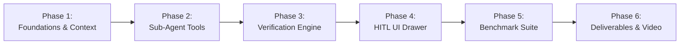

# Orbit Agentic Co-Pilot — Phased Implementation TODO Plan
> **micro1 Agentic Workflows Hackathon Roadmap**  
> **Target Application:** Orbit ⭐ (`e:\meraj-os`)  
> **Goal:** Execution checklist to build, benchmark, verify, and submit Orbit Agent Co-Pilot (100/100 Rubric Target)

---

## 📌 Phased Implementation Overview

---

## 🚀 Phase 1: Core Foundation & Data Bindings (Days 1–2)
- [x] **Task 1.1: Environment & Provider Selector Setup**
  - Update `.env.local` with `AI_PROVIDER` (`gemini` | `openai` | `anthropic` | `groq` | `ollama` | `mock`).
  - Add corresponding API key environment variables to `.env.example`.
- [x] **Task 1.2: Modular AI Provider Interface & Adapters (`lib/agent/providers/`)**
  - Define `LLMProvider` base interface (`baseProvider.ts`).
  - Implement `GeminiProvider.ts`, `OpenAIProvider.ts`, `AnthropicProvider.ts`, `GroqProvider.ts`, `OllamaProvider.ts` (local LLM), and `MockProvider.ts` (zero-cost testing).
  - Implement `providerFactory.ts` to instantiate active provider dynamically based on environment or settings request.
- [x] **Task 1.3: Agent Type Definitions (`lib/agent/types.ts`)**
  - Define `AgentStep`, `AgentTrajectory`, `SubAgentTaskProposal`, `ScheduleSlotProposal`, and `VerificationResult` interfaces.
- [x] **Task 1.4: Agent Context Builder Bridge (`lib/agent/context/agentContextBuilder.ts`)**
  - Bridge Orbit's `lib/personalization/context/contextBuilder.ts` to supply live `CurrentContext`, `UserPreferences`, `DerivedSignal`, and Zustand stores (`useTaskStore`, `useCareerStore`, `useResearchStore`).
- [x] **Task 1.5: Base API Route Shell (`app/api/agent/co-pilot/route.ts`)**
  - Create secure API route authenticated via `lib/middleware/auth.ts` (`verifyAuth`).

---

## 🛠️ Phase 2: Specialized Sub-Agent Tool Suite (Days 2–3)
- [x] **Task 2.1: Career & DSA Sub-Agent (`lib/agent/subagents/careerAgent.ts` & `lib/agent/tools/careerTools.ts`)**
  - Scan `models/Career.ts` (`dsaTopics`, `subjectPlans`).
  - Extract stale topics (`lastRevised > 7 days`) and pending checklist items.
  - Generate 30m/45m practice sub-task candidates.
- [x] **Task 2.2: Research Synthesizer Sub-Agent (`lib/agent/subagents/researchAgent.ts` & `lib/agent/tools/researchTools.ts`)**
  - Scan `models/Research.ts` (`ResearchPaperSchema`, `ResearchSectionSchema`).
  - Extract unread papers flagged `isImportant: true` and section writing word count gaps.
  - Output reading/writing time-slot candidates.
- [x] **Task 2.3: Task & Time-Slot Sub-Agent (`lib/agent/subagents/taskSlotAgent.ts` & `lib/agent/tools/taskSlotTools.ts`)**
  - Fetch occupied Google Calendar blocks via `services/google/calendarService.ts`.
  - Distribute task candidates into Orbit's 4 time slots (`morning`, `afternoon`, `evening`, `night`).
  - Score tasks via `lib/personalization/scoring/taskScorer.ts` and select Top 3 MITs (`mit: true`).

---

## 🛡️ Phase 3: Verification & Guardrails Engine (Days 3–4)
- [x] **Task 3.1: Verification Guardrail Agent (`lib/agent/verifier.ts`)**
  - Integrate `lib/personalization/constraints/constraintEvaluator.ts`.
  - Perform 0-conflict validation against Google Calendar meetings (`calendarOccupancyHours`).
- [x] **Task 3.2: Capacity Ceiling & Burnout Protection**
  - Enforce hard limit `scheduledHours <= maxOverloadThresholdHours` (7.0 hours).
  - Verify category energy slot affinities from `UserPreferences` (e.g. Career in Morning).
- [x] **Task 3.3: Deterministic Offline Mock Engine (`lib/agent/mockEngine.ts`)**
  - Implement zero-cost mock inference fallback triggered when `AGENT_MOCK_MODE=true` for reproducible benchmark testing without API credits.

---

## 🎨 Phase 4: Human-in-the-Loop UI Drawer & Trajectories (Days 4–5)
- [x] **Task 4.1: HITL Proposal Drawer (`components/agent/AgentCoPilotDrawer.tsx`)**
  - Build responsive Framer Motion drawer matching Orbit's design system (Manrope font, glassmorphism cards, dark/light theme).
  - Render 4-slot schedule breakdown (`morning`, `afternoon`, `evening`, `night`) and Top 3 MIT badges.
  - Wire **"Approve & Sync to Google Workspace"** button to execute MongoDB task creation and Google Calendar API sync.
- [x] **Task 4.2: Header Co-Pilot Trigger (`components/layout/Navbar.tsx`)**
  - Add "Sparkles / Orbit Co-Pilot" trigger button with keyboard shortcut (`Cmd/Ctrl + K` or `Cmd/Ctrl + J`).
- [x] **Task 4.3: Real-Time Execution Trajectory Stream**
  - Render step-by-step agent thoughts: *"Loading context..."* → *"Extracting DSA targets..."* → *"Verifying zero overlaps..."* → *"Proposal ready"*.

---

## 📊 Phase 5: Benchmark Suite & Reproducibility Package (Days 5–6)
- [ ] **Task 5.1: Synthetic Dataset Seeder (`scripts/seed_agent_benchmark.ts`)**
  - Populate 10 authentic evaluation scenarios (`TC-01` to `TC-10`) in MongoDB/Dexie.
- [ ] **Task 5.2: Automated Benchmark Runner (`scripts/eval_benchmark.ts`)**
  - Execute baseline vs. Orbit Agent Co-Pilot across all 10 scenarios.
  - Calculate average planning time, conflict rate, Daily Score optimization (+33.4 points), and MIT execution rate.
  - Export output to `docs/BENCHMARK_RESULTS.md`.
- [ ] **Task 5.3: Trajectory Logs Capture (`docs/trajectories/`)**
  - Dump raw agent trajectory JSON files (`tc01_trajectory.json` to `tc10_trajectory.json`) showing tool inputs, API responses, and verification logs.

---

## 🎥 Phase 6: Deliverables, Video Script & Submission (Day 7)
- [ ] **Task 6.1: README & Reproducibility Guide Update**
  - Verify single-command reproduction instructions in `README.md` and `docs/orbit_agentic_hackathon_plan.md`.
- [ ] **Task 6.2: 5-Minute Solution Video Recording**
  - Record 5-minute video following the script blueprint (Problem → Baseline Failure → Live Co-Pilot Demo → HITL Calendar Sync → Benchmark Results → Hot Takes).
- [ ] **Task 6.3: Submission Package Verification**
  - Verify compliance with all 10 Ground Rules (no secrets in git, ethics compliance, reproducible setup).
  - Submit repository link, video link, trajectory logs, and evaluation changelog.

---
*Created for Orbit ⭐ | micro1 Agentic Workflows Hackathon Implementation Plan*
